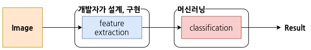
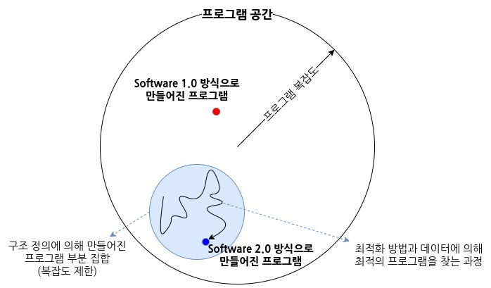
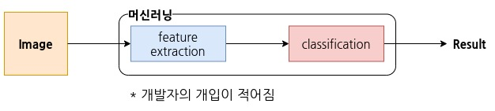
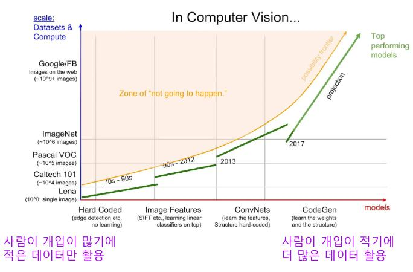
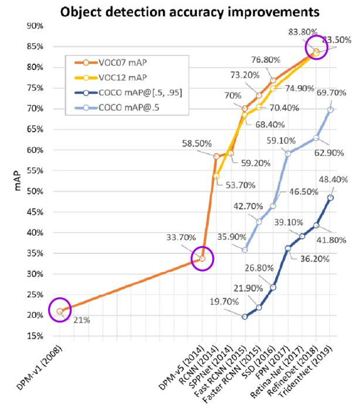

# Software 1.0 VS Software 2.0

software 1.0과 2.0은 소프트웨어 개발 방법론이다. 1.0은 개발자가 코드를 통해 모든 동작을 정의하는 전통적인 방식이며, 2.0은 개발자의 개입은 줄이고 데이터를 통해 최적의 프로그램을 찾는 방식이다.

## Software 1.0

머신러닝, 딥러닝이 적용되지 않은 일반적인 소프트웨어 개발 방식으로 첫 등장 이후 지금까지 잘 작동하고 있다. 현재 사용되고 있는 대부분의 소프트웨어는 1.0 방식으로 개발되었다.

### 1.0 방식의 개발 과정
1. 문제 정의
    * 문제: 요즘 전염병이 유행인데 키오스크같은 공공장소 터치 기기의 위생이 걱정된다. 사람의 손동작을 인식해서 동작하는 가상 마우스를 만들어보자.
2. 큰 문제를 작은 문제들로 분할
    * 가상 마우스를 기능별로 작게 분할해보자.
      * 영상에서 손을 찾는 모듈
      * 손동작을 인식하는 모듈
      * 손동작에 대응되는 커서 조작을 수행하는 모듈
      * 기타
3. 작은 문제들마다 알고리즘, 솔루션 설계
4. 작은 문제들의 솔루션을 통합하여 하나의 시스템 구성

### CV 분야에서의 소프트웨어 1.0

{: .align-center}

CV 분야도 소프트웨어 1.0 방식이 적용되었다. 대표적으로는 오브젝트 디텍션 분야의 DPM(Deformable Part Model). 이미지에서 사람을 찾는다면 사람의 머리를 찾고, 얼굴을 찾고, 왼팔, 오른팔, 다리 등등을 찾고 그 결과를 통합하여 사람의 위치를 특정하는 방식이다. 개발 당시에는 잘 동작하기는 했지만 사람이 아닌 자전거를 찾는다면 바퀴, 프레임, 핸들, 페달, ... 의 자전거의 각 파트를 찾는 모듈이 사람에 의해 설계되어야했다. 즉, 개발자의 노력이 엄청나게 투입되어야하고 대응하기 어려운 케이스도 많았다.

## Software 2.0

{: .align-center}

문제 해결에 신경망 등 머신러닝, AI를 활용하는 방식이다. 개발자는 직접적으로 문제 해결을 위한 코드를 작성하는 대신 신경망 구조와 최적화 방법을 정의한다. 신경망 구조를 정의하면 가중치의 값에 따라 무한히 많은 수의 신경망이 존재한다. 모델의 행동을 정의하는 데이터셋(예를 들어 개와 고양이를 분류한다면 데이터는 개, 고양이 이미지와 알맞는 라벨을 제공해야한다.)과 최적화 방법을 통해 모델은 문제 해결을 위한 최적의 가중치를 찾아 나간다. 

{: .align-center}

## Software 1.0 VS Software 2.0

* Software 1.0
  * 개발자가 직접 문제 해결을 위한 방법을 설계, 구현
* Software 2.0
  * 개발자는 AI 모델 구조를 정의하여 프로그램 범위를 한정
  * 데이터와 최적화 방법을 통해 최적의 프로그램 탐색
  * 모델의 성능 = (모델 구조 + 최적화 방법) + 데이터

Software 1.0 방식은 개발자가 많은 것을 직접 설계, 구현하므로 많은 데이터를 활용할 수 없고 복잡도에도 한계가 있다. 이미지를 100장 정도만 봐도 이전 이미지에 어떤 특징이 있었는지 기억이 나지 않는다. 반면에 Software 2.0 방식은 개발자의 개입이 적으며 최적화 방법을 통해 자동으로 최적의 프로그램을 찾아가므로 훨씬 더 많은 데이터를 활용할 수 있고 훨씬 복잡한 프로그램을 만들 수 있다.

{: .align-center}

**출처: 부스트캠프 AI Tech - 데이터 제작 1강**
{: .text-center}

모델 구조 역시 중요하지만 점차 모델 구조조차도 개발자의 개입이 줄어들고 최적화와 데이터에 더 많은 노력을 투자하는 추세다.

{: .align-center}

**출처: 부스트캠프 AI Tech - 데이터 제작 1강**
{: .text-center}

성능은 압도적. AI가 활용되기 시작한 2014년부터 오브젝티 디텍션 테스크에서 엄청난 성능 향상이 시작되었다.

다만 SW 2.0 방식은 이게 왜 잘 되는지, 왜 잘 안되는지 설명하기가 힘들다. 또한 수많은 데이터에 포함된 바이어스에 의해 모델이 오작동하기도 한다.

## Software 1.0 + Software 2.0

현재 사용되는 대부분의 시스템은 SW 1.0 방식으로 작성되었다. 하지만 AI가 발달하며 점차 시스템의 일부분을 SW 2.0 방식으로 개발하여 대체하고 있다.

# 참고

* [Software 2.0](https://karpathy.medium.com/software-2-0-a64152b37c35) / Andrej Karpathy