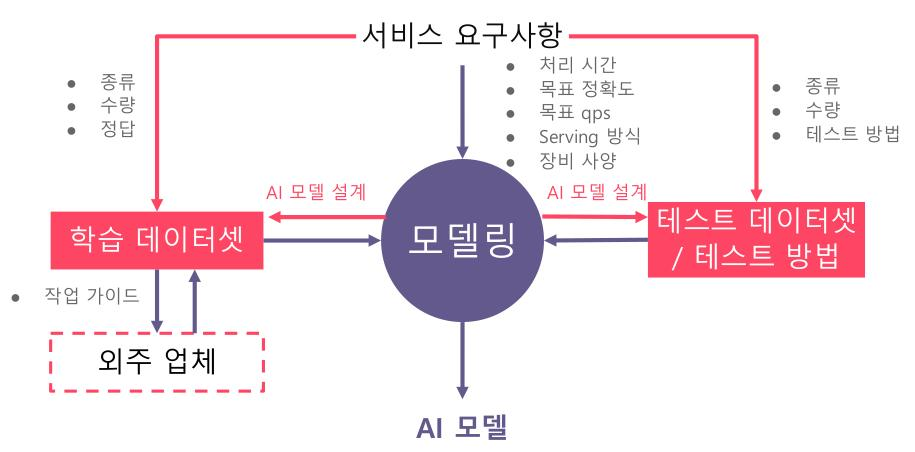
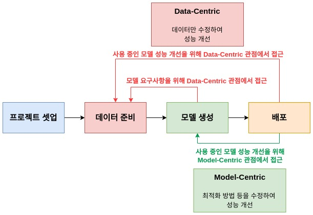
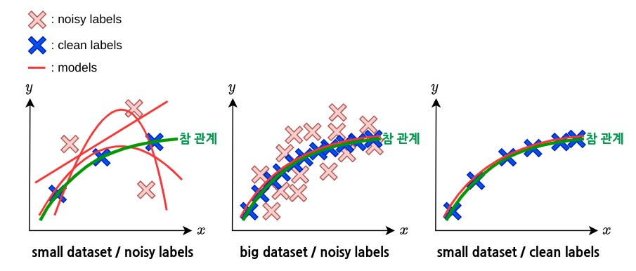
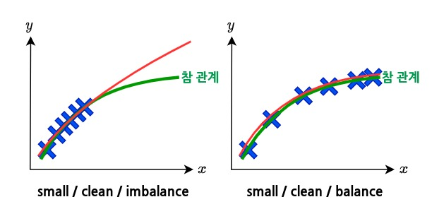
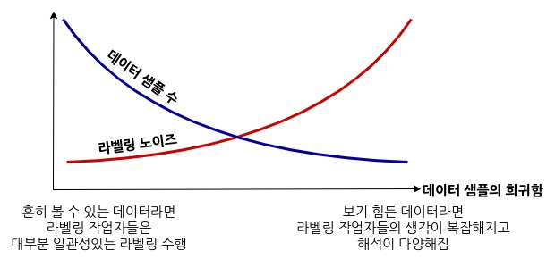
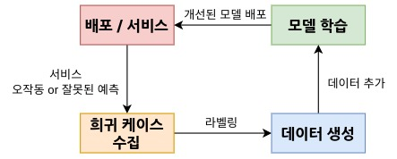

# AI 제품/서비스 개발

{: .align-center}

출처 : **부스트캠프 AI Tech - 데이터 제작 2강**
{: .text-center}

학교 수업, 연구, 대회에서는 주로 데이터셋과 평가 방식이 주어진 상황에서 더 좋은 모델을 찾는 것이 목표다. 반면에 제품/서비스 개발에서는 서비스가 어떤 기능을 어떻게 제공해야하는지 요구사항만 주어지며 데이터셋, 평가 방식이 주어지지 않는 경우가 대부분이다. 그래서 서비스에 적용되는 AI 개발 업무에서 데이터셋 구성 작업이 큰 부분을 차지한다.

## AI 모델 개발 과정

1. 프로젝트 셋업
    * 모델 요구사항 확정
      * 처리 시간, QPS(query per sec.)
      * 목표 정확도(서비스에 적절한 테스트 방식 정의)
      * 서빙 방식
      * 서비스 장비 사양(에지 디바이스, 모바일, PC, ...)
2. 데이터 준비
    * 데이터셋 구성
      * 종류
      * 수량
      * 라벨
3. 모델 생성
    * 모델 학습 및 디버깅
      * 데이터 관련 피드백
        * 모델 학습 관점에서 데이터에 대한 피드백
      * 모델 요구사항 충족
4. 배포
    * 설치 및 유지보수
      * 성능 모니터링 & 이슈 해결 반복
        * 초기 요구사항을 만족하는가?

### 요구사항을 충족시키는 모델의 확보

서비스를 배포하기 위해서는 모델 요구사항을 충족시켜야하고 배포 이후에는 실제 서비스 환경에서도 모델 요구사항만큼의 성능을 보이는지 모니터링하고 모델을 개선해야한다. 배포 이후에는 개발 과정에서 생각하지 못한 상황이 발생할 수 있다.

{: .align-center}
      
모델 개선에는 Data-Centric 관점과 Model-Centric 관점으로 접근할 수 있다. Data-Centric 관점은 데이터만 수정하여 모델 성능을 향상시키는 방식이며 Model-Centric은 데이터는 고정시키고 최적화 방법 등 코드를 수정하여 모델 성능을 향상시키는 방식이다. 

* **서비스 배포 전 / 모델 생성 단계**에서는 모델 요구사항을 충족시키기위해 데이터와 모델 구조, 최적화 방법 등을 수정하며 **Data-Centric, Model-Centric 두 관점에서 모델을 개선한다.**
* 대부분의 모델 요구사항은 모델 생성 단계에서 맞추었으므로 **서비스 배포 후의 대부분의 이슈는 성능에 관한 이슈다.**
  * 모델 구조를 변경하면 QPS, 장비 사양(메모리 크기, ...) 등에 대한 요구사항을 만족하는지 다시 검증해야하므로 **가능하면 모델 구조는 수정하지 않는다.**
  * 그러므로 **배포 후에는 Data-Centric 관점을 중심으로 성능 개선을 시도**하고 Model-Centric 관점에서는 최적화 방법 등을 수정하며 성능 개선을 시도한다.

# 데이터 관련 업무의 어려움

현업에서는 정말 데이터 관련 업무가 많고 어렵다.

🤖: 회사 다닐 때 데이터를 어떻게 어노테이션할지 회의도 많이 하고 고민도 많이 했다. 정말 데이터 작업이 어려움. 데이터 어노테이션 형태에 따라 모델 구조, 형식 모든 것이 바뀔 수 있어 많은 부분을 고려해야한다.

## 어떻게 해야하는지 바이블이 없다.
  * AI 논문 대부분은 모델 구조, 최적화 방법에 대한 논문이다. 대학원은 데이터에 관한 논문을 작성하기 어렵다.
    * 기업은 서비스가 곧 데이터 수집 경로인데 대학원은 좋은 데이터를 많이 모으기가 힘들다.
    * 어노테이션 작업도 상당한 비용이 든다. 대학원생을 시키던, 외주를 맡기던.
    * 작업 기간이 오래 걸린다. 그런데 대학원생들은 빨리 졸업 해야한다.
  * 결국 맨땅에 헤딩하는 경우가 많다.

## 데이터 수집과 어노테이션 작업은 굉장히 힘든 작업이다.

### 무조건 데이터를 많이 모은다고 성능이 향상되지는 않는다.

{: .align-center}

* **라벨링 노이즈를 상쇄할 수 있을 정도로 깨끗하게 라벨링된 데이터가 많아야한다.**
  * 라벨링이 일관되지 않을수록 데이터의 노이즈는 심해진다.
  * small dataset / noisy labels
    * 모델을 학습시킬때마다 전혀 다른 모델들이 나오기 쉽다. 같은 데이터에 대해 예측이 천차만별. 일반화 성능이 떨어진다.
  * big dataset / noisy labels
    * 노이즈를 압도할 수 있을 정도로 깨끗한 데이터가 많다면 좋은 모델을 확보할 수 있다.
  * small dataset / clean labels
    * 적은 데이터로도 좋은 모델을 학습시킬 수 있다.

{: .align-center}

* **데이터가 골고루 수집되어야한다.**
  * 불균형한 데이터셋으로는 모델의 일반화 성능이 떨어질 수 있다.

### 데이터의 불균형을 바로 잡고 라벨링 노이즈를 줄여야한다.

{: .align-center}

보기 힘든 데이터일수록 라벨링 작업자들의 해석이 다양해지고 곧 라벨링 노이즈로 이어진다. 그러므로 지속적으로 데이터 라벨링을 검수하며 희귀 케이스를 어노테이션 가이드에 추가하여 희귀 케이스에 대한 노이즈를 줄여야한다. 또한 희귀 케이스 자체를 많이 수집할 수 있도록 노력해야한다. 

그리고 무엇보다 주어진 문제에서 어떤 것이 희귀 케이스인지를 알아야하므로 도메인 지식, 경험이 풍부해야한다.

# 데이터 관련 업무의 효율화 - Data Engine / Data Flywheel

좋은 데이터셋을 생성하기 위해서는 주어진 문제에 대한 도메인 지식, 경험을 반영하여 희귀 케이스를 미리 파악하고 데이터 수집, 라벨링 작업에서 희귀 케이스에 대한 노력을 더 많이 하는 것이 필요하다.

{: .align-center}

하지만 아무리 노력을 많이 기울여도 모든 희귀 케이스를 미리 알 수 없으므로 **서비스 과정에서 희귀 케이스를 인지하고 수집하여 라벨링하고 다시 서비스에 반영하는 과정을 자동화**하는 것이 필요하다.
