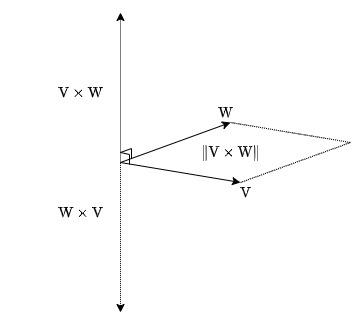
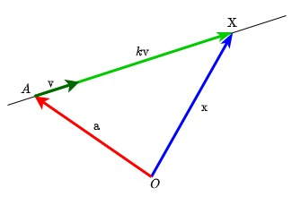
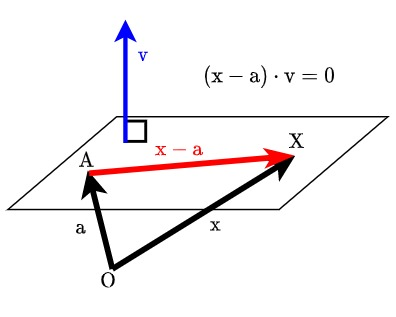

# 🤖 2강. 물리적 벡터

## 1. 벡터와 좌표계

### 평면벡터

$\mathbb{R}^2$에서 크기(스칼라)와 방향을 가지는 표현 도구. 
* 화살표로 표현하고 소문자로 표기한다. ex - $\mathrm{v},\vec{\mathrm{v}}$
* 시점과 종점 상관없이 크기와 방향이 같은 벡터들은 다 같은 벡터
* 평면벡터이므로 $(x, y)$같이 두개의 값으로 구성되는데 단순히 점을 의미하는 것이 아닌 시점에서부터 종점까지 각 성분의 변화량을 나타낸다.

{:.align-center}

### 공간벡터

$\mathrm{R}^3$에서 크기, 방향을 가지는 표현 도구.

### n차원 벡터

$\mathbb{R}^n$ 상의 벡터 $\mathrm{v}=(v_1, v_2, \cdots, v_n)$

### 기타

* 영벡터 $\vec{0}$: 모든 성분이 0인 벡터. $\vec{0}=(0, 0, \cdots, 0)$
* 두 벡터 $\mathrm{v}=(v_1, v_2, \cdots, v_n), \mathrm{w}=(w_1, w_2, \cdots, w_n)$가 같다. $\iff v_1=w_1, v_2=w_2, \cdots, v_n=w_n$

## 2. 벡터의 연산

### 노름, norm

* 벡터의 크기, 길이. $\Vert \mathrm{v} \Vert = \sqrt{v_1^2 + v_2^2 + \cdots + v_n^2}$
  * n차원으로 확장하면 길이라는 개념이 잘 와닿지 않는다. 노름이라고 하자.
* **단위벡터**: 노름이 1인 벡터
  * 정규화: 벡터의 방향은 유지하되 노름을 1로 만든다. $$\frac{\mathrm{v}}{\Vert\mathrm{v}\Vert} = \hat{\mathrm{v}}$$
    * 노름이 모든 성분의 분모로 들어가 노름 계산시에 근호 안을 1로 만든다.
* 표준단위벡터: $\mathrm{e_1}=(1, 0, \cdots, 0), \mathrm{e_2}=(0, 1, \cdots, 0)$처럼 하나의 성분만 1이고 나머지는 0인 벡터. $\Vert e\Vert = 1$
  * $\mathrm{v} = (v_1, v_2, \cdots, v_n) = v_1\mathrm{e_1}+v_2\mathrm{e_2}+\cdots+v_n\mathrm{e_n}$

### 선형결합, linear combination

"선형"을 기하학적인 특성보다는 어떤 의미인지에 집중... 복잡하지 않은.. 결과를 충분히 예상 가능한? 그런 것...(?)

**벡터의 덧셈과 뺄셈**

같은 위치의 성분끼리 더하고 뺀다.
* 평행사변형법: 두 벡터가 만드는 평행사변형의 대각선이 두 벡터의 합
* 삼각형법: $\mathrm{a}$ 벡터의 종점을 $\mathrm{b}$ 벡터의 시점으로 삼아 $\mathrm{b}$ 벡터의 종점이 두 벡터의 합

{:.align-center}

**벡터의 실수배**

벡터의 각 성분을 실수배. 곱하는 실수가 음수이면 방향이 반대로 바뀌지만 원본 벡터와는 평행하다.

**선형(일차)결합**

$\mathbb{R}^n$의 벡터 $\mathrm{w}$가 임의의 실수 $k_1, k_2, \cdots, k_r$와 임의의 벡터 $\mathrm{v_1, v_2, \cdots, v_r}$에 대하여

$$\mathrm{w} = k_1\mathrm{v}_1 + k_2\mathrm{v}_2 + \cdots + k_r\mathrm{v}_r$$

의 형태로 표현되면 $\mathrm{w}$는 $\mathrm{v_1, v_2, \cdots, v_r}$의 선형(일차)결합이다.

어떤 벡터가 다른 벡터들의 실수배의 합으로 표현되면 그 벡터는 다른 벡터들의 선형결합이다.

### 스칼라곱

벡터 $\mathrm{a}$의 노름과 벡터 $\mathrm{b}$가 **$\mathrm{a}$의 방향으로 가하는 노름**의 곱. 벡터의 순서는 상관없다. 결과는 스칼라(크기)이고 점곱(dot product) 또는 내적(inner product)라고도 한다.

$$\begin{matrix}
\mathrm{v\cdot w}&=&\Vert v\Vert\Vert w\Vert cos\theta\\
&=&v_1w_1+v_2w_2+\cdots+v_nw_n
\end{matrix}$$

{:.align-center}

방향이 같은 벡터의 스칼라곱은 두 벡터의 노름 곱과 같다. ($\mathrm{cos}0=1$)

그런데 어떻게 두 벡터의 스칼라곱이 두 벡터의 성분곱의 합인가?

$$\Vert v\Vert\Vert w\Vert cos\theta=v_1w_1+v_2w_2+\cdots+v_nw_n$$

제2코사인법칙을 이용하면 증명된다.

$$\mathrm{\Vert w-v\Vert^2=\Vert w\Vert^2+\Vert v\Vert^2-2\Vert w\Vert\Vert v\Vert cos\theta = \Vert w\Vert^2+\Vert v\Vert^2-2 w\cdot v}$$

$$\mathrm{w\cdot v = \frac{1}{2}\left(\Vert w\Vert^2 + \Vert v\Vert^2 - \Vert w-v\Vert^2\right)}$$

$$=w_1v_1+w_2v_2+\cdots+w_nv_n$$

### 벡터 연산의 성질

벡터 $\mathrm{u, v, w}$ 와 스칼라 $k, m$ 에 대하여

* 벡터의 합
  * 교환법칙, 결합법칙이 성립
  * 항등원 $\vec{0}$ : $\mathrm{u+\vec{0}=\vec{0}+u=\vec{0}}$
  * 역원: $\mathrm{u+(-u)=\vec{0}}$
* 벡터의 실수배
  * 벡터의 합에 대해 좌분배법칙, 우분배법칙 성립
    * $k(\mathrm{u+v})=k\mathrm{u}+k\mathrm{v}$
    * $\mathrm{u}(k+m) = k\mathrm{u}+m\mathrm{u}$
  * 결합법칙 성립: $k(m\mathrm{u})=(km)\mathrm{u}$
  * 항등원 $1$: $1\mathrm{u}=\mathrm{u}$
  * $0\mathrm{u}=\vec{0}, k\vec{0}=\vec{0}$
* 벡터의 스칼라곱
  * 교환법칙 성립
    * **결합법칙은? 두 벡터의 스칼라곱의 결과는 스칼라. 결국 세 벡터의 스칼라곱은 벡터의 순서 상관없이 벡터의 실수배가 된다. 논의할 의미가 없음.**
  * $\vec{0}\cdot\mathrm{u}=\mathrm{u}\cdot\vec{0}=\vec{0}$
  * 벡터의 합에 대해 좌분배법칙, 우분배법칙 성립
  * $k(\mathrm{u\cdot v})=(k\mathrm{u})\cdot\mathrm{v}=\mathrm{u}\cdot(k\mathrm{v})$

### 벡터 곱

$\mathbb{R}^3$에서만 성립하는 벡터 연산. 벡터곱의 결과는 벡터로 **방향은 두 벡터에 수직하고 크기는 두 벡터가 만드는 평행사변형의 넓이**이다. 벡터의 방향은 오른나사법칙을 이용하자. 가위곱(cross product)이라고도 한다. 

{:.align-center}

$$\mathrm{v\times w}=\left(
  \begin{vmatrix}v_2&v_3\\w_2&w_3\end{vmatrix},
  -\begin{vmatrix}v_1&v_3\\w_1&w_3\end{vmatrix},
  \begin{vmatrix}v_1&v_2\\w_1&w_2\end{vmatrix}
\right)$$

### 벡터곱의 성질

$\mathbb{R}^3$의 벡터 $\mathrm{u, v, w}$ 와 스칼라 $k$ 에 대해서

* $\mathrm{u \times v = - (v\times w)}$: 교환법칙은 성립하지 않고 방향이 바뀐다.
* 벡터의 합에 대해서 좌분배, 우분배법칙 성립
* $k(\mathrm{u\times v}) = (k\mathrm{u})\times v = \mathrm{u}\times(k \mathrm{v})$
* 평행사변형의 넓이가 0이면 벡터곱은 $\vec{0}$
  * $\vec{0}\times \mathrm{u} = \mathrm{u\times\vec{0}}=\vec{0}$
  * $\mathrm{u\times u}=\vec{0}$

## 3. 벡터의 응용

### 직선의 표현

$\mathbb{R^2, R^3}$에서 위치벡터가 $\mathrm{a}$인 점 $\mathrm{A}$를 지나고 방향벡터가 $\mathrm{v}$인 직선 위의 임의의 점 $\mathrm{X}$의 위치벡터 $\mathrm{x}$ 는 다음을 만족한다.

{:.align-center}

$$\mathrm{x}=\mathrm{a}+k\mathrm{v}, \quad (k\in\mathbb{R})$$

* 위치벡터: 시점이 원점인 벡터
* 방향벡터: 직선의 방향을 나타내는 벡터

### 평면의 표현

$\mathbb{R^3}$에서 위치벡터가 $\mathrm{a}$인 점 $\mathrm{A}$를 지나고 법선벡터가 $\mathrm{v}$인 평면 위의 임의의 점 $\mathrm{X}$의 위치벡터 $\mathrm{x}$ 는 다음을 만족한다.

{:.align-center}

$$\mathrm{(x-a)\cdot v}=0$$

* 법선벡터: 평면에 수직인 벡터
  * 평면위의 방향벡터는 무수히 많지만 평면의 법선벡터는 크기를 고려하지않으면 두 개뿐이다.
  * 평면위의 임의의 두 점을 잇는 벡터와 수직이다.
  * 평면위의 임의의 두 직선의 방향벡터들을 벡터곱하여 구할 수 있다.