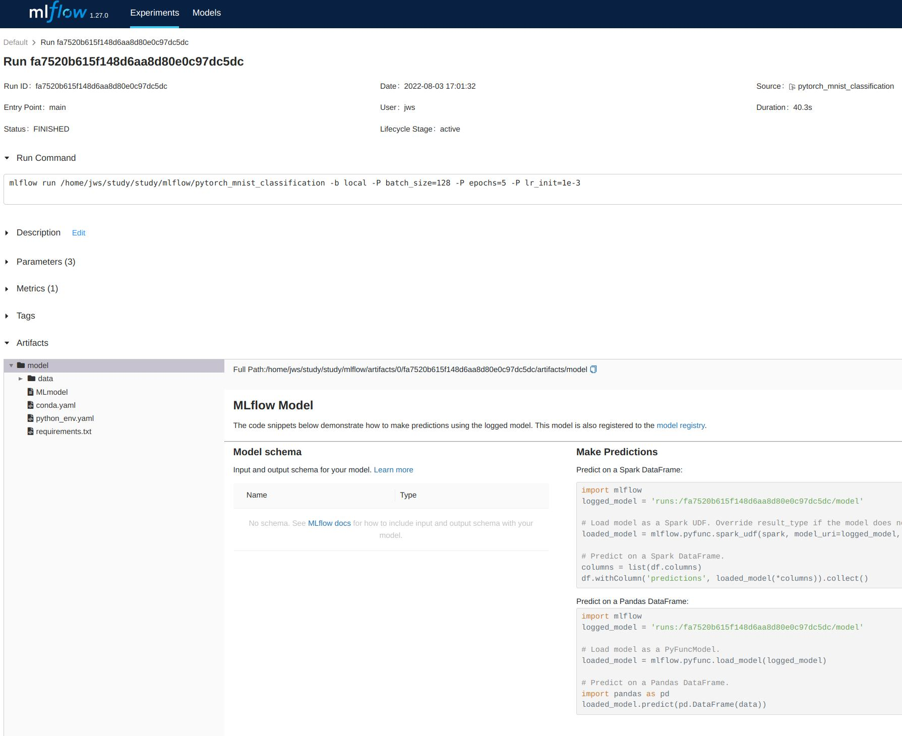

# MLflow

## 머신러닝 워크플로우의 어려움

머신러닝 워크플로우는 "데이터 수집 및 처리 -> 모델 생성(학습) -> 배포 및 모니터링" 을 계속 반복하는 형태. 서비스 과정에서 계속 새로운 데이터를 수집하여 모델의 성능을 향상시키며 서비스 질을 향상시켜나간다. 이 과정에서 몇 가지 어려움이 있다.

1. 실험 관리
  * 하이퍼파라미터 설정과 메트릭을 기록해야 어떤 하이퍼파라미터 설정이 어떤 결과를 내는지를 비교할 수 있다. 엑셀에 수작업으로 정리하는 것은 귀찮고 깔끔하게 정리하기도 쉽지 않다.
2. 결과의 재현
  * 내 코드를 누군가가 가져다가 다시 사용하거나 스케일링을 통해 더 큰 서비스를 준비할 수도 있다. 이때 내가 기록한 결과를 다시 재현할 수 있어야하는데 단순히 코드, 하이퍼파라미터뿐 아니라 환경(이용한 패키지의 버전 등)도 동일해야 결과를 재현할 수 있다.
3. 모델 패키징 및 배포 표준의 부재
4. 모델 관리를 위한 저장소의 부재
  * 모델의 라이프사이클 관리를 위해 여러 모델을 비교하고 배포할 수 있는 중앙 저장소가 필요하다.

## MLflow를 통한 머신러닝 워크플로우 관리

MLflow는 4가지 컴포넌트를 통해 머신러닝 워크플로우를 더 매끄럽게 해준다.

1. Tracking
  * 실험 파라미터, 매트릭, 아티팩트, 코드 버전을 기록한다.
2. Projects
  * 코드를 실행하는 환경을 패키징한다. 어떤 버전의 패키지가 사용되었는지, 어떤 파라미터를 사용하는지, 어떻게 코드를 실행시키는지를 기록해 언제 어디서든지 동일한 환경으로 실험을 재현할 수 있도록 한다.
3. Models
  * 생성된 모델을 다양한 형식으로 패키징하고 서빙할 수 있도록 한다. 
4. Registry
  * 중앙 모델 저장소로 모델 라이프사이클을 관리한다.

# 간략한 실험관리 튜토리얼

간단하게 파이토치로 mnist 분류 모델을 작성하고 MLflow를 통해 실험관리를 수행.

## MLflow 설치
```bash
pip3 install mlflow
```

## mnist 분류 코드 작성

```python
import argparse

import torch
from torch.utils.data import DataLoader
from torchvision import datasets, transforms
from tqdm import tqdm
import mlflow

from model import MNISTClassifier


def train(model, dataloader, criterion, optimizer):
    model.train()
    device = next(model.parameters()).device

    loss_sum = 0.
    for x, y in tqdm(dataloader):
        x, y = x.to(device), y.to(device)

        pred = model(x)
        loss = criterion(pred, y)

        optimizer.zero_grad()
        loss.backward()
        optimizer.step()

        loss_sum += loss.item()
    print(f'\ttrain loss: {loss_sum/len(dataloader):.4f}')


def validation(model, dataloader, criterion):
    model.eval()
    device = next(model.parameters()).device
    total_samples = len(dataloader.dataset)

    loss_sum = 0.
    total_correct_pred = 0
    for x, y in tqdm(dataloader):
        x, y = x.to(device), y.to(device)

        pred = model(x)
        with torch.no_grad():
            loss_sum += criterion(pred, y).item()
            total_correct_pred += correct_pred(pred, y).item()

    accuracy = total_correct_pred / total_samples
    loss_mean = loss_sum/len(dataloader)
    print(f'\tvalid loss: {loss_mean:.4f} / accuracy: {accuracy*100:.2f} %')

    return loss_mean, accuracy


def correct_pred(pred, target):
    """배치 예측과 타겟 비교, 일치하는 샘플 수 반환"""
    return torch.eq(pred.argmax(dim=-1), target).sum()


def get_mnist_loader(batch_size, train=True):
    """mnist 데이터셋 로드하여 데이터로더로 반환"""
    transform = transforms.ToTensor()
    mnist = datasets.MNIST(root='./data', train=train, transform=transform, download=True)
    loader = DataLoader(mnist, batch_size=batch_size, shuffle=train, drop_last=train)
    return loader


def main(args):
    # 데이터 로더 생성
    train_loader = get_mnist_loader(args.batch_size, True)
    valid_loader = get_mnist_loader(args.batch_size * 2, False)

    # 모델 생성
    device = 'cuda' if torch.cuda.is_available() else 'cpu'
    model = MNISTClassifier().to(device)
    # 🔥 모델이 코드와 독립된 상태로 작동할 수 있도록 직렬화
    model = torch.jit.script(model)
    
    criterion = torch.nn.CrossEntropyLoss()
    optimizer = torch.optim.Adam(model.parameters(), lr=args.lr_init)
    scheduler = torch.optim.lr_scheduler.StepLR(optimizer, step_size=args.epochs//4, gamma=.5)

    best_acc = 0.
    for epoch in range(args.epochs):
        print(f'epoch: {epoch+1} / current lr: {scheduler.get_last_lr()}')
        train(model, train_loader, criterion, optimizer)
        _, acc = validation(model, valid_loader, criterion)

        if best_acc < acc:
            best_acc = acc
            print(f'\tupdate best validation accuracy: {best_acc}')

        scheduler.step()

    # 🔥 mlflow logging - 메트릭, 모델 로깅
    with mlflow.start_run() as run:
        mlflow.log_metric('best accuracy', best_acc)
        mlflow.pytorch.log_model(pytorch_model=model, artifact_path='model', registered_model_name='mnist_classifier')


if __name__ == '__main__':
    parser = argparse.ArgumentParser(description='simple mnist classification args')
    parser.add_argument('--batch_size', default=16, type=int, help='training batch size')
    parser.add_argument('--epochs', default=10, type=int, help='total training epochs')
    parser.add_argument('--lr_init', default=1e-3, type=float, help='initial learning rate')
    args = parser.parse_args()

    main(args)
```

### 메트릭, 모델 로깅을 위한 준비

* `model = torch.jit.script(model)`
  * 보통 파이토치 모델은 코드를 통해 모델을 생성하고 학습된 가중치를 불러와 이용하는데 TorchScript 통해 모델을 직렬화하고 패키징하여 독립적으로 사용될 수 있도록 한다. 직렬화되어 저장된 모델은 c++에서도 사용할 수 있다.
  * MLflow에서 모델을 로깅하고 다시 사용할때 모델 구조를 정의한 코드까지 관리하는 번거로움을 피하기위해 이용하나?
* 로깅 코드
  * `mlflow.log_metric('best accuracy', best_acc)`
    * 메트릭을 로깅
  * `mlflow.pytorch.log_model(pytorch_model=model, artifact_path='model', registered_model_name='mnist_classifier')`
    * 학습된 모델을 로깅

## MLflow Project 컨벤션 작성

**파일명은 MLproject**. 모델 학습 코드를 실행하는 방식과 필요한 파라미터를 명시한다. mlflow는 이 파일의 내용을 참고하여 코드를 실행한다.

```text
name: simple_mnist_classification

entry_points:
  main:
    parameters:
      batch_size: {type: int, default: 16}
      epochs: {type: int, default: 10}
      lr_init: {type: float, default: 1e-3}
    command: "python train.py --batch_size {batch_size} --lr_init {lr_init} --epochs {epochs}"
```

* `parameters`: argparse를 통해 입력받는 파라미터를 작성한다. 이 파라미터들은 자동으로 로깅된다.
* `command`: 터미널에서 학습 코드를 실행시키는 커맨드를 입력한다.

```bash
pytorch_mnist_classification
├── MLproject  # 실행하려는 코드와 같은 디렉토리에 위치
├── __pycache__
├── data
├── model.py
└── train.py
```

## 트래킹 서버 실행

MLflow 튜토리얼의 사이킷런 모델을 학습시키고 로깅하는 예제는 서버를 따로 띄울 필요없이 과정이 완결되었는데 파이토치 모델을 로깅하려니 따로 서버를 띄워야했다. DB가 필요하다는데 사이킷런과 파이토치의 로깅시의 차이는 더 공부가 필요하다.
{: .notice--warning}

일단 로컬에서 트래킹 서버를 띄운다. 포트 기본값은 5000

```bash
mlflow server --backend-store-uri sqlite:///mlflow.db --default-artifact-root $(pwd)/artifacts
```
커맨드를 실행한 디렉토리에 `mlflow.db`와 `artifacts` 디렉토리가 생성되었다. `artifacts` 디렉토리에는 모델, 이미지 등 학습 산출물이 저장되고 `mlflow.db`에는 파라미터, 메트릭 등이 기록된다.

```bash
.
├── artifacts  # 모델, 이미지 등 학습 산출물 저장
├── mlflow.db  # 파라미터, 메트릭 등 기록
└── pytorch_mnist_classification  # 학습 코드, MLproject 파일 포함
```

## run

`mlflow run {프로젝트디렉토리}`로 학습을 실행. 프로젝트디렉토리 내부의 MLproject 파일 내용을 참고하여 코드가 실행된다. 콘다를 이용하지 않고 미리 환경을 설정해놓아서 `--no-conda`를 붙였다.

```bash
export MLFLOW_TRACKING_URI="http://127.0.0.1:5000"  # 트래킹 서버 환경변수 설정

mlflow run pytorch_mnist_classification --no-conda
```

하이퍼파라미터는 다음과 같이 `-P {파라미터}={값}` 형식으로 전달한다.

```bash
mlflow run pytorch_mnist_classification -P epochs=5 -P batch_size=128 --no-conda 
```

## 실험 기록 확인

실행된 트래킹 서버에 접속한다(http://127.0.0.1:5000/). 다음과 같이 run마다 하이퍼파라미터와 메트릭을 확인할 수 있다.

{:align-center}

특정 run을 선택하면 상세 정보를 볼 수 있다.

{:.align-center}

하단의 `Artifacts` 탭에서는 파일로 저장된 내용들을 볼 수 있다. `conda.yaml`, `requirements.txt` 파일에는 파이썬 패키지와 버전이 기록되어 어떤 환경에서 코드가 실행되었는지를 알려주며 `MLmodel`에는 저장된 model의 메타정보가 담겨있다. `data` 디렉토리에는 pth 확장자로 토치 모델이 저장된다.

```text
# conda.yaml

channels:
- conda-forge
dependencies:
- python=3.8.10
- pip<=22.2.1
- pip:
  - mlflow
  - cloudpickle==2.1.0
  - torch==1.12.0
  - tqdm==4.64.0
name: mlflow-env
```

위의 아티팩트들은 모두 트래킹 서버 실행과 함께 생성된 `artifatcs` 디렉토리에 실험별 run 디렉토리에 저장된다.
```text
artifacts/
└── 0  # 실험 ID
    ├── 67270d7f34284279a9f26ba1c401515e  # run hash
    │   └── artifacts
    │       └── model
    │           ├── MLmodel
    │           ├── conda.yaml
    │           ├── data
    │           ├── python_env.yaml
    │           └── requirements.txt
    ├── e0a12e130e3e4c8281ac8af31bf1619b
    │   └── artifacts
    │       └── model
    │           ├── MLmodel
    │           ├── conda.yaml
    │           ├── data
    │           ├── python_env.yaml
    │           └── requirements.txt
    └── fa7520b615f148d6aa8d80e0c97dc5dc
        └── artifacts
            └── model
                ├── MLmodel
                ├── conda.yaml
                ├── data
                ├── python_env.yaml
                └── requirements.txt
```

# -
간단한 튜토리얼만 따라해봤다. tracking, projects, models, registry 컴포넌트별로 내용이 많고, 클라우드를 통해 트래킹서버, 아티팩트 스토리지, 데이터베이스를 띄워 본격적으로 실험 기록, 모델 관리를 수행할 수 있으며 서빙도 간단히 할 수 있는 듯 하다. mlflow는 공부할 부분이 매우 많은 것 같다... 정진...
{:.notice--primary}


# 참고
* [MLflow](#https://mlflow.org/docs/latest/index.html){: .btn .btn--info}
* [MLflow Concepts](#https://mlflow.org/docs/latest/concepts.html){: .btn .btn--info}
* [MLflow Tutorials and Examples](#https://mlflow.org/docs/latest/tutorials-and-examples/index.html){: .btn .btn--info}