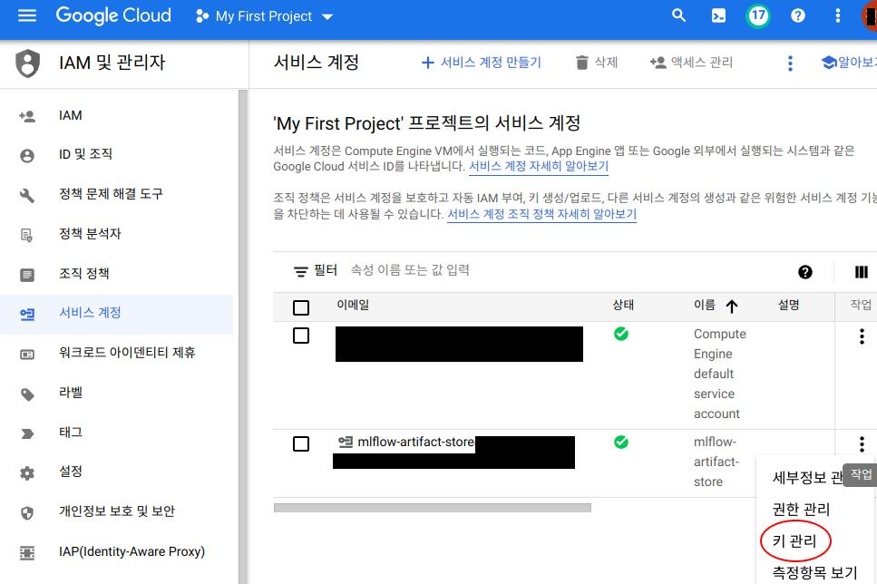

GCP에 대해 아는게 없어서 cloud storage, cloud sql, compute engine 설정은 기본 설정을 사용함.
{:.notice--info}

# GCP에 트래킹 서버 띄우기 - 시나리오 5

{:.align-center}

트래킹 서버를 띄울 compute engine, 백엔드 스토어 역할의 cloud sql, 아티팩트 스토어 역할의 cloud storage가 필요하다.

## 0. GCP 방화벽 규칙 생성

{:.align-center}

compute engine 생성시에 외부에서의 접근을 허용하지 않아 방화벽 규칙을 추가하여 접속이 가능하도록 설정한다. IPv4 범위를 `0.0.0.0/0`으로 두어 모든 IP를 허용하고, 트래킹 서버의 기본 포트는 5000이므로 5000 포트도 허용해준다.

## 1. compute engine, cloud SQL, cloud storage 생성

기본 설정을 이용했으므로 생략.. 뚝딱뚝딱 생성한다.

### compute engine에 접근할 수 있도록 방화벽 규칙 적용

{:.align-center}

생성한 compute engine에는 이전에 생성한 방화벽 규칙을 적용한다. 네트워크 태그에 방화벽 규칙에 지정한 태그를 추가한다.

## 2. cloud storage 서비스 계정과 key 생성

{:.align-center}

`IAM 및 관리자 - 서비스 계정` 메뉴에서 cloud storage에 접근할 수 있는 서비스 계정을 생성한다. 권한은 `Cloud Storage - 저장소 관리자`. 더 작은 권한이 있지만 편하게 크게 설정.

{:.align-center}

`서비스 계정` 메뉴에서 생성한 서비스 계정의 key를 생성한다. json 타입으로 생성하여 보관. 아래의 cloud storage 접속 설정을 위해 compute engine에 복사해놓는다.


## 3. compute engine 세팅

### cloud storage 접속 설정

```bash
# python3 pip 설치
sudo apt update
sudo apt install python3-pip

# google-cloud-storage 설치
pip3 install google-cloud-storage

# 서비스 계정 로그인
gcloud auth activate-service-account {서비스 계정명} --key-file {서비스 계정 키 json 파일 경로}

# cloud storage 접속 확인 - 파일 전송 시도
touch test.txt  # 더미 파일
gcloud alpha storage cp test.txt gs://{위에서 생성한 cloud storage URI}

# 환경변수로 권한 설정 - key 파일 경로 명시
export GOOGLE_APPLICATION_CREDENTIALS="{서비스 계정 키 json 파일 경로}"
```

**2**에서 생성한 서비스 계정과 key 파일로 compute engine에서 권한을 설정한다. cloud storage URI는 `gs://{생성한 cloud storage 이름}`이다.

{:.align-center}

잘 설정되었다면 위와 같이 파일이 제대로 전송된다.

### MLflow 설치

```bash
# 파이썬 가상환경 설정 - cli에서 mlflow 커맨드를 이용하기 위해 필수
python3 -m venv venv
source venv/bin/activate

# 라이브러리 설치
pip3 install mlflow
pip3 install psycopg2-binary
pip3 install google-cloud-storage
```

### compute engine에서 cloud SQL에 접속할 수 있도록 설정

[링크: Compute Engine에서 연결](https://cloud.google.com/sql/docs/postgres/connect-compute-engine?hl=ko#connect-gce-public-ip){: .btn .btn--info}

## 4. tracking server 실행

```bash
mlflow server \
  --backend-store-uri {cloud SQL URI} \
  --artifacts-destination {cloud storage URI} \
  --serve-artifacts \
  --host 0.0.0.0 \
```

**cloud SQL URI**

`<dialect>+<driver>://<username>:<password>@<host>:<port>/<database>` 형식을 따른다. 나는 cloud SQL에 mlflow_account 계정을 생성하고 비밀번호를 1234로 설정했다. 그리고 mlflow_db 라는 이름으로 데이터베이스를 생성했다. 그래서 다음과 같이 입력한다. 포트는 불필요.

* postgresql://mlflow_account:1234@{cloud SQL IP주소}/mlflow_db

**cloud storage URI**

cloud storage URI. `gs://{생성한 cloud storage 이름}/{cloud storage 하위 경로}`

**모든게 잘 설정되었다면 compute engine 외부 아이피, 5000번 포트로 접속하면 MLflow UI를 볼 수 있다.**

## 5. 로컬에서 실험 로깅해보기

### MLFLOW_TRACKING_URI 설정

```bash
# local에서
export MLFLOW_TRACKING_URI="http://{compute engine 외부 아이피}:5000"

# MLflow run~
mlflow run ~
```

다음과 같이 run이 기록된다.

{:.align-center}


cloud SQL에 엔티티가 기록되었다.

```text
psql (12.11 (Ubuntu 12.11-0ubuntu0.20.04.1), server 14.4)
WARNING: psql major version 12, server major version 14.
         Some psql features might not work.
SSL connection (protocol: TLSv1.3, cipher: TLS_AES_256_GCM_SHA384, bits: 256, compression: off)
Type "help" for help.

mlflow_db=> \list
mlflow_db=> select * from metrics;
      key      | value  |   timestamp   |             run_uuid             | step | is_nan 
---------------+--------+---------------+----------------------------------+------+--------
 best accuracy | 0.9787 | 1659714342865 | b940de1100dd45b7a818d420e0241ce5 |    0 | f
 best accuracy | 0.9802 | 1659714406851 | 7915ed6df6614317bae262a19ee7796c |    0 | f
...
```

cloud storage에는 아티팩트만 기록되었다.

{:.align-center}


# 참고
* [MLflow](#https://mlflow.org/docs/latest/index.html){: .btn .btn--info}
* [MLflow Concepts](#https://mlflow.org/docs/latest/concepts.html){: .btn .btn--info}
* [MLflow Tutorials and Examples](#https://mlflow.org/docs/latest/tutorials-and-examples/index.html){: .btn .btn--info}