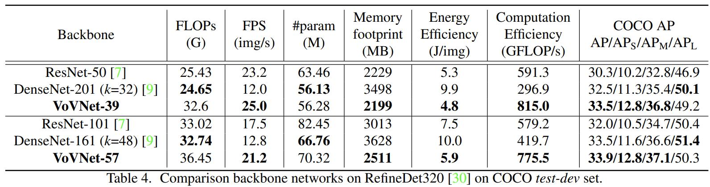

<div markdown="1">
<font size="6"><B>An Energy and GPU-Computation Efficient Backbone Network
<br>for Real-Time Object Detection<br>2019</B></font>
</div>
{:.text-center}

# 요약

* DenseNet이 ResNet보다 FLOPs와 가중치 수 측면에서 가벼워도 인퍼런스 속도가 느리고 전력 효율이 낮은 것은 **Dense Connection의 feature 재활용으로 인한 MAC(memory access cost) 증가와 GPU 병렬성 저하**때문임을 지적함.
* Dense Connection에서 중간 레이어간의 연결이 불필요함을 보이고 이를 제거해 MAC와 GPU 병렬성을 개선한 OSA 모듈을 제시함.
* 실험을 통해 OSA 모듈로 구성된 VoVNet이 DenseNet보다 성능, 인퍼런스 속도, 전력 효율 측면에서 뛰어남을 증명함.

# 본문

DenseNet은 **①** receptive field의 크기가 다른 여러 레이어의 feature를 재활용하여 여러 스케일의 시각적 정보를 이용하고, **②** 정보 손실이 없는 concatenative aggregation 방식을 이용하므로 디텍션 테스크에서 ResNet보다 좋은 성능을 보임.

하지만 DenseNet은 적은 FLOPs와 가중치 수에도 불구하고 ResNet보다 전력 소비가 크고 인퍼런스가 느림. FLOPs, 가중치 수가 네트워크의 효율성을 직접적으로 나타내지 못하고 있음.

## 효율적인 네트워크 디자인 요소

그간 빠르고 가벼운 네트워크를 디자인하기 위해 FLOPs와 가중치 수 감소에 중점을 두었으나 두 요소가 네트워크의 속도와 전력 효율을 대변하지 못함 (ex - ShuffleNetV2가 비슷한 규모의 MobileNetV2보다 GPU에서 빠름 / 가중치의 수가 AlexNet의 2%에 불과한 SqueezeNet이 더 많은 전력을 소비함.)

### MAC(Memory Access Cost)

CNN의 경우 연산 자체보다 피연산 텐서가 담긴 메모리에 대한 접근이 연산 시간과 소비 전력의 대부분을 차지함. 따라서 같은 규모의 네트워크더라도 구조에 따라 메모리 접근의 양이 다르다면 연산 시간과 전력 소비가 다름. 따라서 레이어의 연산을 위해 필요한 메모리 접근의 양을 표현한 MAC를 고려하여 네트워크를 디자인해야함.

$$MAC = hw(c_i+c_o) + k^2c_ic_o$$

위의 식은 conv 레이어 연산을 위해 필요한 메모리 접근의 양을 표현함. $h$, $w$는 feature의 크기, $c_i$, $c_o$는 입출력 채널, $k$는 커널 크기를 의미함. 한 번의 conv을 위해서는 크기 $hwc_i$인 입력 텐서와 $k^2c_ic_o$ 커널을 가져와야하고 $hwc_o$ 크기의 연산 결과를 다시 메모리에 저장함.

산술기하 평균의 관계를 떠올리면 $c_i+c_o \ge 2\sqrt{c_ic_o}$ 이므로 연산량이 동일한 경우 입출력 채널의 크기가 같을 때 MAC는 최소가 됨.

ex) 1x1 conv
* $(c_i, c_o)=(5, 5)$
  * 가중치, 연산: 1x1x5x5 = 25
  * MAC: $$hw(5+5)+1^2\times5\times5 = 10hw+25$$
* $(c_i, c_o)=(1,25)$
  * 가중치, 연산: 1x1x1x25 = 25
  * MAC: $$hw(1+25)+1^2\times1\times25=26hw+25$$

### GPU 병렬성

FLOPs를 최소화하는 방식은 모든 부동소수점 연산이 항상 같은 시간에 처리된다는 관점에 기인함. 하지만 GPU는 병렬 연산을 수행하여 여러 부동소수점 연산을 한 번에 처리할 수 있음. 그러므로 GPU가 한 번에 처리하는 연산을 최대화하여 병렬성을 향상시킬수록 전체 연산을 효율적으로 처리하게 됨.

따라서 동일한 연산이라면 작은 연산을 수행하는 다수의 레이어보다는 큰 연산을 수행하는 소수의 레이어로 네트워크를 구성해야함. 또한 레이어가 많을수록 커널 런칭과 synchronization에 대한 오버헤드가 증가함. (CUDA에서 커널은 함수, 런칭은 호출을 의미하며 커널은 비동기적으로 수행됨. 즉, 함수 호출에 대한 오버헤드와 각 함수가 완료될때까지 대기하며 생기는 오버헤드가 증가하게 됨.)

이러한 관점에서 depthwise conv, 1x1 bottleneck 구조는 FLOPs를 낮추더라도 큰 연산을 순차적인 작은 연산으로 나눠 수행하므로 GPU 병렬성을 낮추는 요인임.

## DenseNet은 느리고 전력 효율이 낮다

```python
# torchvision densenet121
DenseNet(
  (features): Sequential(
    ...
    (denseblock1): _DenseBlock(
      (denselayer1): _DenseLayer(
        ...
        (conv1): Conv2d(64, 128, kernel_size=(1, 1), stride=(1, 1), bias=False)
        ...
        (conv2): Conv2d(128, 32, kernel_size=(3, 3), stride=(1, 1), padding=(1, 1), bias=False)
      )
      (denselayer2): _DenseLayer(
        ...
        (conv1): Conv2d(96, 128, kernel_size=(1, 1), stride=(1, 1), bias=False)
        ...
        (conv2): Conv2d(128, 32, kernel_size=(3, 3), stride=(1, 1), padding=(1, 1), bias=False)
      )
      ...
```
DenseNet의 연산 블럭은 선형적으로 증가하는 입력 채널 수를 적은 FLOPs로 처리하기위해 1x1 conv(bottleneck) 구조를 활용함. 또한 전체적인 연산량을 감안하여 3x3 conv의 출력 채널 수는 작은 값으로 설정하였음(aggregation되는 feature의 수는 $1 + 2 + 3 + ... + n = \frac{n(n+1)}{2}$, 레이어의 입력 채널 수가 $O(n^2)$으로 증가함)

1x1, 3x3 conv의 입출력 채널 수의 불균형으로 MAC가 높으며, 1x1 conv의 활용으로 GPU 병렬성을 저하함. 그 결과로 DenseNet은 낮은 FLOPs에 비해 느리고 전력 효율이 나쁨.


## OSA(One-shot aggregation) 모듈

### DenseConnection 분석

{:.align-center}

위 차트는 DenseLayer의 1x1 conv(타겟 레이어)와 이전 레이어들(소스 레이어)의 연결 강도를 표현한 히트맵. 타겟 레이어의 1x1 conv의 필터 가중치를 이전 레이어들의 feature 채널 수대로 분할하여 평균 L-1 norm을 계산하고 최댓값으로 정규화함.

* DenseBlock1
  * 타겟 레이어가 주로 직전 소스 레이어의 feature에만 강하게 반응하며 transition 레이어는 대부분의 중간 레이어들과 고르게 결합
* DenseBlock3
  * DenseBlock1에 비해 타겟 레이어가 이전의 여러 소스 레이어의 feature에 고르게 반응하는 경향을 보이되 classification layer는 가까운 소스 레이어들의 feature에만 강하게 반응

위의 관찰을 통해 "중간 레이어들**간**의 결합"과 "최종(transition or classifier) 레이어와 중간레이어들의 결합"이 음의 상관관계가 있다는 가설을 세움. 만약 DenseLayer가 이전 레이어들의 feature들과 유사하되 더 효과적인 feature를 생성한다면 가설은 사실이라 할 수 있음. 

중간 레이어들간의 결합이 비슷한 feature를 생성하도록 한다면 최종 레이어에서는 후반부 레이어의 feature와 비슷하되 질이 떨어지는 초반부 레이어의 feature에 반응할 필요가 없으며 이러한 상황을 DenseBlock3에서 볼 수 있음. 반대로 DenseBlock1에서는 중간 레이어들간의 결합이 약하므로 각 레이어는 고유한 feature를 생성하여 최종 레이어에서 여러 feature에 고르게 반응한다고 해석할 수 있음.

**정리하면 중간 레이어들간의 결합이 강하면 비슷한 feature를 만들어내고, 결합이 약하면 연결할 필요가 없음. 중간 레이어들간의 연결은 cost 대비 효과적이지 않다는 가설에 도달함.**

### torchvision.models.densenet121

```python
# DenseNet121
d121 = torchvision.models.densenet121(True, False)
n_layers = (6, 12, 24, 16)
block_ch_in = 64
growth = 32


def get_l1_norm(w: torch.Tensor, c_0: int, growth: int):
    """1x1 conv와 이전 레이어들의 feature의 연결 강도(L-1 norm) 계산"""
    c_in = w.size()[1]
    c_conn = c_in - c_0  # aggregation된 채널 수
    
    # 가중치를 DenseBlock 입력 채널 수, 이전 레이어 feature 채널 수로 분할
    w_split = torch.split(w, [c_0] + [growth] * (c_conn // growth), dim=1)
    l1 = np.array([np.abs(x.detach().numpy()).sum() / np.size(x.detach().numpy()) for x in w_split])
    l1_norm = l1 / l1.max()
    return l1_norm


def draw_heatmap(elems_list):
    """연결 강도 시각화"""
    length = len(elems_list)
    elems_list_pad = [np.pad(elems, (0, length-len(elems))) for elems in elems_list]
    elems_square = np.stack(elems_list_pad)
    plt.gca().invert_yaxis()
    plt.pcolor(elems_square.T, cmap='jet')
    plt.colorbar()
    plt.show()


c_0 = block_ch_in
for blk_idx, n_layer in enumerate(n_layers, 1):
    blk = getattr(d121.features, f'denseblock{blk_idx}')
    
    norm_l1_list = []
    
    for layer_idx in range(1, 1+n_layer):
        layer = getattr(blk, f'denselayer{layer_idx}')
        norm_l1_list.append(get_l1_norm(layer.conv1.weight, c_0, growth))
    print(layer_idx+1)
    
    transition = hasattr(d121.features, f'transition{blk_idx}')
    if transition:
        t = getattr(d121.features, f'transition{blk_idx}')
        norm_l1_list.append(get_l1_norm(t.conv.weight, c_0, growth))
        c_0 = t.conv.weight.size()[0]
        print('ho')
    else:
        # 마지막 DenseBlock은 transition 없음. classifier 가중치 시각화
        c_w = d121.classifier.weight
        norm_l1_list.append(get_l1_norm(c_w, c_0, growth))
    print(f'# denselayer: {layer_idx}, transition: {transition}, c_0: {c_0}')
        
    draw_heatmap(norm_l1_list)
    print('\n')
```

토치비전의 d121 모델 중 DenseBlock3의 레이어 결합을 시각화하면 다음과 같음.

{:.align-center}

* 파란색으로 표시될 정도로 결합이 약한 부분은 없음
* 중반부까지 레이어들은 직전 레이어와 강하게 연결되며 17번째 레이어가 위의 예시의 transition 레이어처럼 이전 모든 레이어들과 고르게 연결됨
  * 중반부까지는 상관도가 낮은 고유한 feature 생성 중?
* 중반부부터는 중반부 너머의 레이어들간의 결합이 강해짐. 하지만 비슷한 feature를 생성하지는 않는지 최종 레이어와 고르게 연결됨
  * 논문의 가설과는 다소 다른 경향을 보임. 하지만 후반부 레이어도 레이어 층이 낮아질수록 최종 레이어와의 결합이  약해지는 경향은 존재하는 것 같음.

다음은 DenseBlock4의 레이어 결합 시각화

{:.align-center}
* 대부분의 레이어가 DenseBlock의 입력 feature와 강하게 결합
  * 최종 레이어에서는 블럭의 입력 feature와의 결합이 0에 가까움. 여러 레이어들이 입력 feature와 강하게 결합되며 입력 feature를 포함하는 출력을 생성한 듯 보임.
* 중후반부 레이어들간의 결합은 매우 약함. 중후반부 레이어와 최종 레이어의 결합이 매우 강함.
  * 초반 레이어의 feature에만 집중하며 고유한 feature를 생성한 듯 보임.

DenseBlock4의 가중치 일부를 0으로 만들어 이미지넷 validation top-1 정확도를 측정함.

{:.align-center}

* DenseNet121 top-1 acc.: 74.44 %
* A
  * ```python
    num_params = 0
    num_zeros_before = 0
    num_zeros = 0
    with torch.no_grad():
        for i in range(9, 17):
            dlayer = getattr(dnet_0.features.denseblock4, f'denselayer{i}')
            num_zeros_before += int((dlayer.conv1.weight == 0.).sum().detach().cpu())
            dlayer.conv1.weight[:, 512: 512 + 32 * 4].zero_()
            num_params += dlayer.conv1.weight.numel()
            num_zeros += int((dlayer.conv1.weight == 0.).sum().detach().cpu())
    ```
  * 9~16th 레이어 가중치의 15% 제거
  * top-1 acc.: 72.24 % (-2.2%)
* B
  * ```python
    num_params = 0
    num_zeros_before = 0
    num_zeros = 0
    with torch.no_grad():
        for i in range(9, 17):
            dlayer = getattr(dnet_0.features.denseblock4, f'denselayer{i}')
            num_zeros_before += int((dlayer.conv1.weight == 0.).sum().detach().cpu())
            dlayer.conv1.weight[:, 512 + 32 * 4:].zero_()
            num_params += dlayer.conv1.weight.numel()
            num_zeros += int((dlayer.conv1.weight == 0.).sum().detach().cpu())
    ```
  * 9~16th 레이어 가중치의 27% 제거
  * top-1 acc.: 73.37 % (-1.07%)

결합 강도가 더 높은 A 부분이 더 정확도에 큰 영향을 줌. 다만 레이어들이 블럭의 입력 가중치와 매우 강하게 연결되어 다른 레이어의 feature를 무시해도 정확도가 치명적으로 감소하지는 않음.

약간의 정확도 향상을 위해 모델을 매우 크게 키우기도 하지만 지금 상황은 정확도 향상을 위해 cost 대비 효율적이지는 않은 연산을 추가한 것이 아니라 DenseConnection 구조가 설계 의도대로 학습되지 않은 것으로 봐야할 것 같다.
{:.notice}


### OSA 모듈

* 가설1 : DenseConnection의 "중간 레이어들간의 결합"과 "최종 레이어와 중간 레이어들의 결합"은 음의 상관관계가 존재.
* 가설2 : DenseConnection의 중간 레이어들간의 결합은 효율적이지 않다.

위의 가설을 증명하기 위해 중간 레이어들간의 연결을 제거한 모듈을 제시. 모든 레이어들의 feature는 최종 레이어에서 단 한번만 agrregation됨(One-shot aggregation, OSA 모듈). 더 이상 중간 레이어의 입력 채널 수가 변하지 않음. 따라서 1x1 conv(bottleneck) 레이어를 제거하고 중간 레이어의 입출력 채널 수를 동일하게 설정할 수 있음.

{:.align-center}

#### 실험1. DenseNet과 비슷한 규모, 같은 레이어 수의 OSA 네트워크

{:.align-center}

* cifar10 데이터셋 활용
* DenseNet 대비 다소 낮은 정확도: 93.6% (-1.2%)
* 중간 레이어들간의 연결이 없어져 최종 레이어와 중간 레이어들의 연결이 강해짐
* transition 레이어가 초반부 레이어들과 강하게 결합

#### 실험2. OSA 모듈 재정의

* 실험1 반영
  * transition 레이어와 후반부 레이어들의 연결이 강하지 않아 후반부 레이어 제거 (12층 -> 5층)
  * 줄어든 연산량만큼 남은 레이어의 출력 채널 수 증가 (k = 43)

{:.align-center}

* 비슷한 정확도: 94.6% (**-0.2%**)
  * 중간 레이어들간의 결합이 없고 레이어 수가 적음에도 비슷한 성능을 기록
* **MAC 감소: 3.7M -> 2.5M**
  * **중간 레이어들의 입출력 채널 수가 같음**
* **GPU 병렬성 향상**
  * **중간 레이어에서의 feature aggregation이 사라져 연산량을 줄이기 위한 1x1 conv 레이어가 불필요함**
  * **연산이 큰 적은 수의 레이어로 네트워크 구성**


OSA 모듈은 ① 최종 레이어와 중간 레이어들간의 결합이 고르게 강하며, ② 중간 레이어들간의 결합 없이도 DenseNet과 비슷한 성능을 기록하며 MAC, GPU 병렬성을 개선했다는 점에서 가설1, 2를 뒷받침함.

 ## 실험

 ### VoVNet

 {:.align-center}

 cifar10 벤치마크가 디텍터 백본으로써의 네트워크 성능을 대표할 수 없으며 실제로 MAC, GPU 병렬성 개선 효과를 확인하기 위해 OSA 모듈로 이루어진 VoVNet을 활용하여 실험 진행. 디텍션 테스크는 high-level feature가 중요하여 후반부 스테이지의 OSA 모듈 채널 수를 증가시킴. DenseNet은 적은 채널 수의 많은 feature를 활용하려했다면 VoVNet은 많은 채널 수의 적은 feature를 활용함.

### 평가 지표

DenseNet을 경우를 통해 FLOPs와 가중치의 수가 네트워크의 속도와 에너지 효율을 나타내지 못한다는 점을 알 수 있었음. 따라서 네트워크 속도와 에너지 효율을 직접 평가 지표로 사용함.

* FPS
  * GPU: Titan X
* FLOPS (FLOPs / sec)
  * 초당 수행되는 연산량. GPU에서 얼마나 빠르게 연산이 수행되는지를 평가하여 GPU 연산 효율성을 평가
* 이미지당 전력 소비
  * `nvidia-smi`를 이용해 GPU 파워 사용(1W = 1J / sec)을 기록
  * $$\frac{AveragePower [J/sec]}{FPS [frame/sec]} = J / frame$$


### DSOD / voc2007test

{:.align-center}

* vs. DenseNet67
  * +1.2 mAP
  * 비슷한 FLOPs임에도 FPS, 메모리 사용량, 전력 소비, FLOPS에서 압도
* vs. 낮은 FLOPs의 디텍터
  * VoVNet-DSOD 대비 FLOPs가 1/5 수준의 디텍터들보다 2배의 FPS를 기록
  * Pelee, MobileNet은 큰 conv 레이어를 작게 쪼개는 방식으로 FLOPs를 감소시킨 네트워크로 FLOPS에서 큰 차이를 보이며 큰 연산의 레이어를 다수의 작은 레이어들로 쪼개는 방식이 GPU 연산 효율성에 악영향을 준다는 것을 보여줌.
  * DenseConnection이 없는 MobileNet은 적은 메모리 사용량에도 불구하고 훨씬 높은 전력이 필요함. 이는 다수의 depthwise conv 레이어로 인해 작게 쪼개진 텐서에 대한 메모리 접근이 필요하기 때문.


### RefineDet / COCO test-dev

{:.align-center}

* vs. DenseNet, ResNet
  * mAP_L을 제외한 모든 실전적인 평가지표에서 가장 뛰어남
  * 특히 디텍션의 난관 중 하나인 작은 오브젝트에 대한 mAP에서 가장 좋은 성능을 보임
    * summation보다는 여러 스케일의 feature를 concatenation이, 다수의 작은 feature보다는 소수의 큰 feature가 효과적임을 보여줌.

### Mask R-CNN from scratch

{:.align-center}

2 stage-detector / segmentation에서도 ResNet보다 빠르고 높은 성능을 보여줌.


## 마무리

OSA 모듈은 중간 레이어들의 feature를 마지막 레이어에서 한 번만 aggregation함. 중간 레이어간의 결합을 제거해 DenseConnection의 feature를 재활용하는 특성을 활용함과 동시에 비효율성(느린 속도와 높은 전력소비)을 개선함. DenseNet과 비교하여 디텍션 백본으로써 더 좋은 성능, 뛰어난 효율성을 보여줌.
