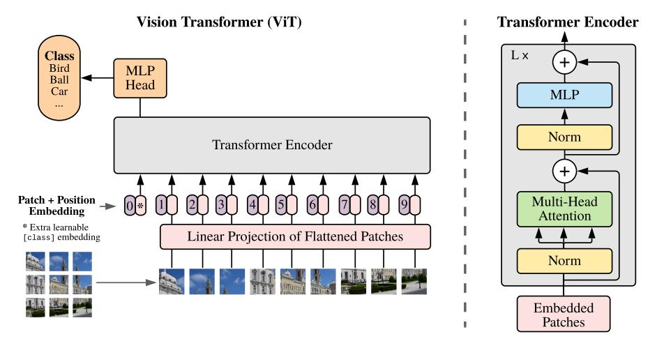
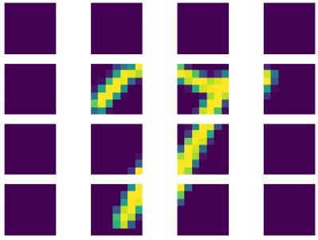
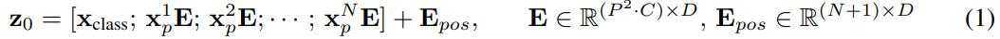
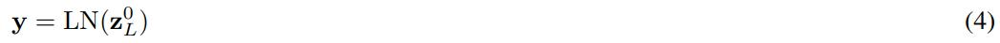
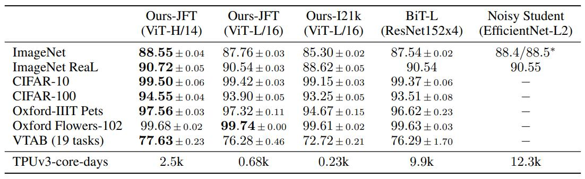
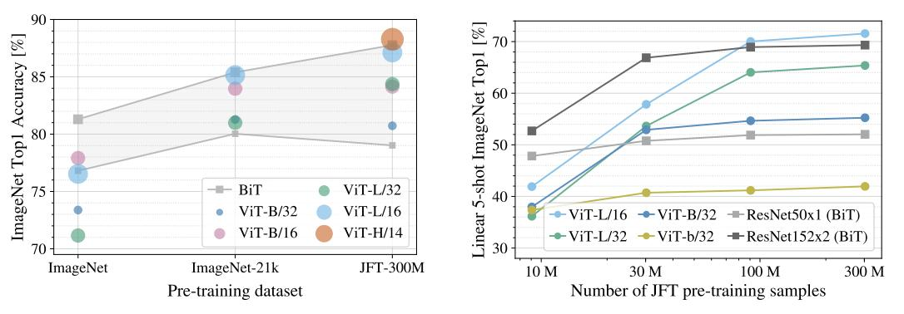
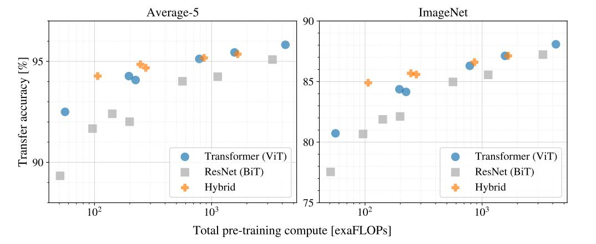
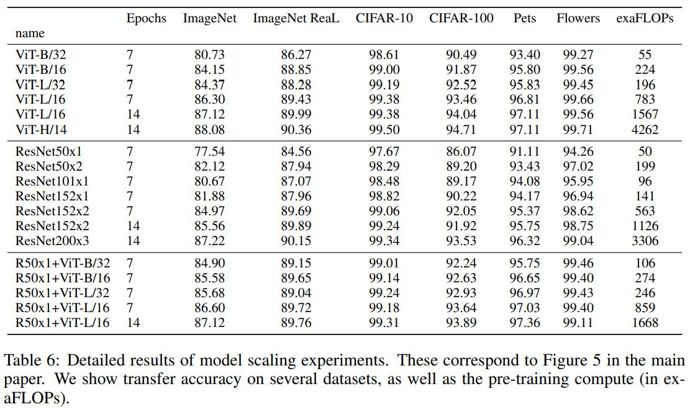
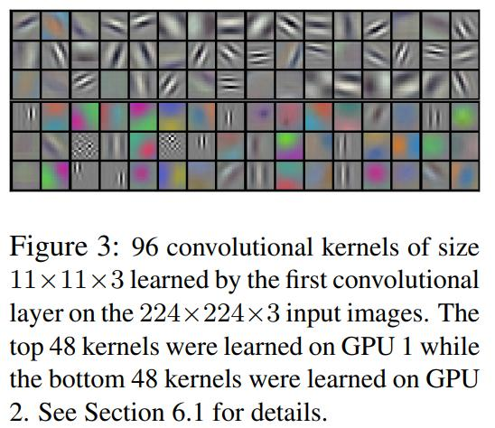
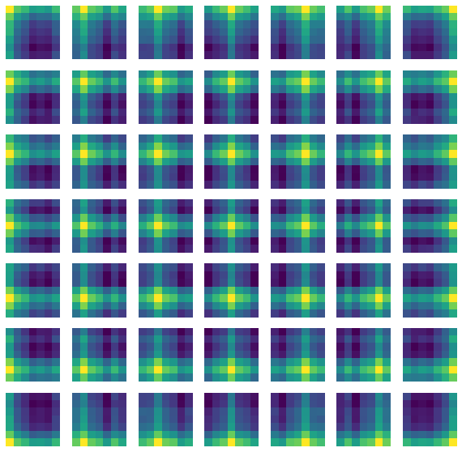

트랜스포머는 NLP 분야에서 사실상의 표준으로 자리 잡았으나 CV 분야에서는 영 힘을 못썼다. 트랜스포머로 구성된 분류 모델인 **ViT(Vision Transformer)**는 CNN에 비해 부족한 인덕티브 바이어스 때문에 일반화되는데 큰 데이터셋이 필요하지만 큰 데이터셋에 대한 사전 학습 후 벤치마크 데이터셋에 대한 전이학습을 통해 기존 CNN 계열의 SOTA 모델보다 높은 성능을 보여준다.
{:.notice--success}

<div class="notice--info" markdown="1">
**inductive bias, 인덕티브 바이어스**
* [위키](https://en.wikipedia.org/wiki/Inductive_bias)
* 모델이 접한 적 없는 데이터에 대한 예측을 할 때 이용하는 가정들
  * 접한 적 없는 입력과 출력의 관계에 대한 가정
* CNN 계열의 인덕티브 바이어스는 locality, translation invariance
  * 인접한 픽셀들의 결합으로 패턴이 형성되며, 이미지의 어떤 위치에 타겟 패턴이 존재하더라도 슬라이딩 윈도우 방식으로 패턴을 잡아낸다.
* 🤖 모델 구조, 알고리즘이 특정 task에서 잘 동작하기 위해 갖게 된 제약, 가정이라고 생각하면 어떨지? (예를 들면 conv 레이어는 오직 밀집된 픽셀에서만 정보를 얻게 설계되어 CV 분야에서 잘 동작한다?)
</div>

## 트랜스포머는 inductive bias가 부족해 많은 데이터가 필요하다.

트랜스포머는 높은 연산 효율과 scalability 덕에 거대한 모델을 학습시킬 수 있었고, 큰 데이터셋에 대한 사전 학습 후 전이학습을 하는 방식으로 많은 task에서 SOTA를 달성했다. CV에서도 트랜스포머의 장점을 이용해보려는 시도가 있었지만 하드웨어 가속기에서 동작시키려면 복잡한 엔지니어링이 필요해 여전히 SOTA 모델들은 CNN 계열이었다. (당시 SOTA: ... -> BiT -> EfficientNet: NoisyStudent)

저자들은 트랜스포머를 약간 수정하고 이미지를 패치 단위로 쪼개 패치 임베딩을 만들어 이미지넷 분류 모델을 학습시켰다**(ViT: Vision Transformer)**. 성능은 비슷한 크기의 ResNet보다 다소 낮았는데 저자들은 이 결과를 인덕티브 바이어스의 부족으로 모델이 일반화되기 위한 데이터가 충분치 않다는 해석을 내린다.

저자들의 해석대로 거대한 데이터셋을 이용하는 경우 상황이 달라진다. 이미지넷-21k, JFT-300M 데이터셋으로 사전 학습을 시킨 후 다른 벤치마크 데이터셋에 전이학습 시키면 기존 CNN 계열의 SOTA 모델들보다 높은 성능을 보여준다.

## ViT: Vision Transformer

{:.align-center}

### 패치 임베딩

표준 트랜스포머와 마찬가지로 ViT도 시퀀스를 다룬다. 이미지를 조각조각 패치로 잘라서 flatten 후 linear projection을 통해 임베딩을 만든다. BERT의 [class] 토큰과 유사하게 학습 가능한 임베딩을 패치 임베딩 앞에 덧붙인다. 트랜스포머의 최종 출력에서 이 임베딩은 어텐션을 통해 이미지 전체의 정보를 담은 이미지 리프레젠테이션 $y$ 역할을 한다. 패치 임베딩에 포지션 인코딩을 더해 패치의 위치 정보를 담는데 표준 트랜스포머와는 다르게 학습 가능한 파라미터를 사용한다.

{:.align-center}

{:.align-center}

* $\mathbf{z}_0$: 입력 시퀀스, 패치 임베딩
* $\mathbf{x}_{class}$: class 토큰 (이미지 리프레젠테이션을 담는 역할)
* $\mathbf{x}^i_p$: flatten된 i번째 패치
* $\mathbf{x}^i_p\mathbf{ E}$: 패치 시퀀스의 linear projection, $\mathbf{E}\in\mathbb{R}^{P^2\cdot C \times D}$
  * $P$: 패치 사이즈
  * $D$: linear projection 차원
  * $C$: 이미지 채널 수
* $\mathbf{E}_{pos} \in \mathbb{R}^{(N+1)\times D}$: 포지션 인코딩
  * $N$: 전체 패치의 수
  * $N+1$: class 토큰이 추가되어 +1

```python
...
from einops.layers.torch import Rearrange
from einops import repeat


class PatchEmbedding(nn.Module):
    def __init__(self, img_size=28, ch=1, patch_size=7, n_patch=4, d=16, drop_p=.0):
        super().__init__()
        self.img_size = img_size
        self.patch_size = patch_size
        self.n_patch = n_patch
        self.d = d
        
        self.lin_proj = nn.Linear(patch_size*patch_size*ch, d)
        self.drop = nn.Dropout(drop_p)
        
        # 이미지를 패치 단위로 쪼개는 레이어
        self.rearrange = Rearrange('b c (h_n h_p) (w_n w_p) -> b (h_n w_n) (c h_p w_p)', w_n = n_patch, h_n = n_patch)
        
        # 클래스 토큰과 포지션 인코딩 - 학습 가능한 파라미터를 이용
        self.class_token = torch.nn.Parameter(torch.randn(1, 1, d))
        self.pos_enc = torch.nn.Parameter(torch.randn(1, n_patch*n_patch+1, d))
        
    def forward(self, x):
        # x: (B, C, img_size, img_size)
        # x_reshape: (B, n_patch, patch_size*patch_size*C)
        # embedding: (B, n_patch+1, d)
        
        B = x.size()[0]
        
        x = self.rearrange(x)  # 패치 단위로 분할
        x = self.lin_proj(x)  # projection
        x = self.drop(x)
        
        # 클래스 토큰을 덧붙이고 포지션 인코딩을 더한다.
        cls_tok_repeat = repeat(self.class_token, 'b n d -> (batch b) n d', batch=B)
        x = torch.cat([cls_tok_repeat, x], dim=1)
        x = self.pos_enc + x
        x = self.drop(x)
        
        return x
```

### 트랜스포머 인코더

표준 트랜스포머에서 약간 수정되었다. 레이어 정규화가 MSA(Multiheaded Self-Attention) 레이어와 MLP 레이어 전으로 내려왔다. MSA 레이어는 표준 트랜스포머와 동일하며 MLP 레이어는 2개의 linear 레이어 사이에 GELU를 activation으로 사용한다. 표준 트랜스포머와 마찬가지로 인코더를 중첩하여 활용한다.

{:.align-center}

* $\mathbf{z}_l$: $l$번째 인코더 출력

```python
class MultiHeadAttention(nn.Module):
    def __init__(self, d=16, n_head=2, drop_p=.0):
        super().__init__()
        self.lin_Q = nn.Linear(d, d)
        self.lin_K = nn.Linear(d, d)
        self.lin_V = nn.Linear(d, d)
        self.lin_O = nn.Linear(d, d)
        self.drop = nn.Dropout(drop_p)
        
        self.n_head = n_head
        self.scale_factor = torch.sqrt(torch.tensor(d / n_head))
        
    def forward(self, x):
        B, N, d = x.size()
        
        # 임베딩 시퀀스를 Query, Key, Value로 변환
        Q = self.lin_Q(x)
        K = self.lin_K(x)
        V = self.lin_V(x)
        
        # multihead attention을 수행하도록 Q, K, V를 n_head개로 분할
        Q = Q.reshape(B, N, self.n_head, -1).transpose(1, 2)  # (B, n_head, N, d_k)
        K = K.reshape(B, N, self.n_head, -1).transpose(1, 2)
        V = V.reshape(B, N, self.n_head, -1).transpose(1, 2)
        
        # attention
        attention_scores = torch.matmul(Q, K.transpose(-2, -1)) / self.scale_factor  # (B, n_head, N, N)
        attention_weights = torch.softmax(attention_scores, dim=-1)
        attention_values = torch.matmul(attention_weights, V)  # (B, n_head, N, d_v)
        
        # 여러 head들의 value를 다시 모아 하나의 시퀀스로 projection
        values_concat = attention_values.permute(0, 2, 1, 3).reshape(B, N, -1)
        output = self.lin_O(values_concat)
        output = self.drop(output)
        
        return output
    

class MLP(nn.Module):
    def __init__(self, d=16, multiple=4, drop_p=.0):
        super().__init__()
        self.lin_0 = nn.Linear(d, d * multiple)
        self.gelu = nn.GELU()
        self.lin_1 = nn.Linear(d * multiple, d)
        
        self.drop = nn.Dropout(drop_p)
        
    def forward(self, x):
        x = self.lin_0(x)
        x = self.gelu(x)  # GELU!
        x = self.drop(x)
        x = self.lin_1(x)
        x = self.drop(x)
        return x
    

class EncoderBlock(nn.Module):
    def __init__(self, d=16, n_head=2, multiple=4, drop_p=.0):
        super().__init__()
        
        self.ln_mha = nn.LayerNorm(d)
        self.mha = MultiHeadAttention(d, n_head, drop_p)
        self.ln_mlp = nn.LayerNorm(d)
        self.mlp = MLP(d, multiple, drop_p)
        
    def forward(self, x):
        x_ln = self.ln_mha(x)  # 레이어 정규화가 각 서브레이어 앞에 위치
        x_mha = self.mha(x_ln)
        x = x_mha + x  # residual connection
        
        x_ln = self.ln_mlp(x)
        x_mlp = self.mlp(x_ln)
        x = x_mlp + x
        return x
```

### ViT

마지막 트랜스포머 인코더의 출력에서 첫번째 임베딩($\mathbf{y}=\mathbf{z}_L^0$)을 1층 MLP에 입력해 클래스를 예측한다. 각 레이어에 추가된 dropout과 classification head 이후의 tanh는 논문의 appendix에서 찾아볼 수 있다.

conv 연산을 통해 네트워크 전체에 locality, translation invariance가 녹아있는 CNN에 비해 ViT는 인덕티브 바이어스가 적다. 처음 작게작게 패치를 쪼개 임베딩을 만드는 부분과 MLP 연산에서만 locality, translation invariance 특성이 있고 그 외에는 모두 global하다.

이미지에 바로 트랜스포머를 연결하지 않고 CNN의 피쳐맵에 트랜스포머를 연결한 하이브리드 모델도 가능하다.

{:.align-center}

```python
class ViT(nn.Module):
    def __init__(self, num_classes=10, n_enc=2, img_size=28, img_ch=1, patch_size=7, n_patch=4, d=16, n_head=2, multiple=4, drop_p=.0):
        super().__init__()
        self.emb_layer = PatchEmbedding(img_size, img_ch, patch_size, n_patch, d, drop_p)
        self.enc_list = nn.ModuleList([EncoderBlock(d, n_head, multiple, drop_p) for _ in range(n_enc)])
        self.enc_out_ln = nn.LayerNorm(d)
        self.cls_head = nn.Linear(d, num_classes)
        
    def forward(self, x):
        x = self.emb_layer(x)
        
        # 인코더 중첩 연산
        for enc in self.enc_list:
            x = enc(x)
        
        # 레이어 정규화
        x = self.enc_out_ln(x[:, 0])  # z^0_L = y
        x = self.cls_head(x)
        x = torch.tanh(x)
        
        return x
```

<div class="notice--info" markdown="1">
MNIST 데이터를 CrossEntropyLoss, Adam, 15 Epochs 학습시키면 validation 정확도 약 96%
```python
=================================================================
Layer (type:depth-idx)                   Param #
=================================================================
├─PatchEmbedding: 1-1                    --
|    └─Linear: 2-1                       800
|    └─Dropout: 2-2                      --
|    └─Rearrange: 2-3                    --
├─ModuleList: 1-2                        --
|    └─EncoderBlock: 2-4                 --
|    |    └─LayerNorm: 3-1               32
|    |    └─MultiHeadAttention: 3-2      1,088
|    |    └─LayerNorm: 3-3               32
|    |    └─MLP: 3-4                     2,128
|    └─EncoderBlock: 2-5                 --
|    |    └─LayerNorm: 3-5               32
|    |    └─MultiHeadAttention: 3-6      1,088
|    |    └─LayerNorm: 3-7               32
|    |    └─MLP: 3-8                     2,128
├─LayerNorm: 1-3                         32
├─Linear: 1-4                            170
=================================================================
Total params: 7,562
Trainable params: 7,562
Non-trainable params: 0
=================================================================
```
</div>

## ViT vs. CNN

ViT와 SOTA CNN의 성능을 비교해본다.

### 실험 모델
* ViT: 'ViT-모델크기/패치크기'로 표기. 패치크기가 작을수록 시퀀스가 길어져 연산이 커진다. 인코더의 수, MLP 사이즈, $D$를 통해 사이즈 조절
  * Huge: ViT-H/14
  * Large: ViT-L/16, Vit-L/14
  * Base: ViT-B/16, Vit-B/14
* BiT: ResNet 기반의 SOTA (20년 초)
* EfficientNet-NoisyStudent: 최신 SOTA (20년 초)
  * 이미지넷-21k, JFT-300M을 semi-supervised learning

### 실험
이미지넷-21k, JFT-300M으로 ViT, BiT를 사전학습 시킨 후 여러 벤치마크 데이터셋에 전이학습시켜 성능을 비교. (EfficientNet은 NoisyStuendent 방식으로 학습)

**사전 학습에 필요한 리소스와 성능 비교**

{:.align-center}

약간 작은 ViT-L 모델로도 BiT 모델보다 좋은 성능을 냈고 가장 큰 ViT-H는 EfficientNet보다 좋은 성능을 냈다. 하단의 TPUv3-core-days는 사전학습에 사용된 TPU 코어 수와 사전학습 기간(일 단위)의 곱으로 작을수록 사전학습에 필요한 연산 리소스가 적다는 의미이다. ViT가 필요로 하는 연산 리소스가 다른 모델들에 비해 훨씬 작음을 알 수 있다.

**데이터 필요량**

ViT가 얼마나 많은 사전학습 데이터가 필요한지 알아보는 실험. 이미지넷, 이미지넷-21k, JFT-300M, JFT-300M의 서브셋으로 ViT, BiT를 학습시켜 1) 이미지넷에 파인튜닝 후 정확도 비교 2) few-shot evaluation 비교

{:.align-center}

좌측 그래프) 데이터셋 크기별로 이미지넷 파인튜닝 정확도를 비교한다. 중간 사이즈의 이미지넷 데이터셋에서는 ViT가 BiT보다 낮은 성능을 기록하고 또 ViT 라지 모델이 베이스 모델보다 낮은 성능을 보여준다. 하지만 점차 데이터셋이 커질수록 ViT가 BiT보다, 라지모델이 베이스모델보다 좋은 성능을 낸다. 

우측 그래프) JFT-300M 데이터셋의 서브셋을 점차 키워가며 모델 성능 비교. 마찬가지로 적은 데이터에서는 BiT가 우세하나 데이터가 많아질수록 ViT가 더 좋은 성능을 보이며 성능 증가의 둔화도 더 늦게 나타난다. 

이 두 실험에서 CNN은 작은 데이터셋에서 성능이 좋고, ViT는 큰 데이터셋에서 성능이 좋음을 알 수 있었다. 이를 통해 인덕티브 바이어스는 작은 데이터셋에 대해서 좋은 성능을 낼 수 있도록 하지만 데이터가 충분히 많은 경우에는 인덕티브 바이어스 없이 패턴을 학습할 수 있으며 더 유익함을 보여준다.

**사전학습에 필요한 연산량과 퍼포먼스 비교 - scaling study**

{:.align-center}

사전학습에 필요한 연산량과 그에 따른 퍼포먼스를 비교하는 실험으로 세 종류의 모델을 크기에 따라 JFT-300M 데이터셋을 7 epochs, 14epochs 사전 학습 후 파인튜닝 시켜 이미지넷 정확도를 비교한다. 

위 그래프의 가로축은 사전 학습에 필요한 연산량, 세로축은 이미지넷 정확도. 같은 사전학습 연산량에서 ViT가 BiT보다 높은 성능을 내며 연산량과 퍼포먼스 트레이드 오프에서 유리함을 보여준다. 하이브리드 모델은 ViT보다 더 나은 모습을 보이다가 점차 비슷해지거나 나빠진다.

게다가 정확도가 계속 상승하며 사전학습을 더 길게 수행하면 더 높은 성능도 달성할 수 있을 것으로 보인다.

🤖: 하이브리드 모델이 점차 ViT와의 성능 격차가 줄어드는 것은 인덕티브 바이어스가 빠르게 패턴을 뽑아내지만 학습이 계속 될수록 점차 패턴 학습에 방해가 되는건가?
{: .notice--danger}

{:.align-center}
위 실험을 정리한 테이블. 똑같이 7epochs을 학습하고 비슷한 연산량이 측정된 ViT와 BiT를 비교했을때 성능차이가 크다. 충분히 데이터가 많은 경우에 비슷한 크기의 모델로 똑같이 데이터를 보여준다면 ViT가 BiT보다 훨씬 잘 학습한다... 신기하네
{: .notice--info}


## ViT 내부

{:.align-center}


### figure 7 left: 임베딩 레이어의 필터는 CNN의 저층 레이어처럼 기초적인 특징을 잡아낸다.

임베딩 레이어는 flatten된 패치를 임베딩으로 projection하는데 필터를 시각화하면 CNN의 저층 레이어 커널 시각화 결과와 비슷하게 선, 점들을 볼 수 있다.

{:.align-center}

출처: **ImageNet Classification with Deep Convolutional
Neural Networks**
{:.text-center}

### figure 7 center: 인접한 위치의 포지션 임베딩끼리, 같은 행과 열에 속하는 임베딩끼리 유사도가 높게 학습된다.

패치의 2D 위치 정보를 사람이 넣어주지 않아도 알아서 근접한 포지션 임베딩끼리, 같은 행과 열에 속한 포지션 임베딩끼리 코사인 유사도가 높아지도록 학습된다.

포지션 임베딩의 유무에 따른 성능차이는 확연하지만 1D 포지션 임베딩이나 2D 포지션 임베딩 등 임베딩의 형식에 따른 성능차이는 없다. 저자들은 포지션 임베딩이 픽셀 단위의 위치가 아닌 패치 단위의 위치를 표현하므로 spatial representation의 학습 난이도가 낮아 어떤 임베딩 형식을 사용하던 무관한 것으로 예상했다.

```python
import timm


# timm에서 학습된 ViT를 하나 잡아와 포지션 임베딩의 코사인 유사도를 시각화
m = timm.create_model('vit_base_patch32_224', pretrained=True)
m.eval()
pos_enc = m.pos_embed

n = 7
pos_enc_grid = einops.rearrange(pos_enc[0, 1:], '(h w) d -> h w d', h=n)

plt.figure(figsize=(10, 10))
for i in range(n**2):
    r = i // n
    c = i % n
    
    with torch.no_grad():
        result = cos(pos_enc_grid, pos_enc_grid[r, c])
    
    plt.subplot(n, n, i+1)
    plt.imshow(result.cpu().numpy())
    plt.axis('off')
plt.show()
```

{:.align-center}

### figure 7 right: 는 잘 모르겠는데... 더 공부하고 추가하기로...


"attention distance"가 뭔지 모르겠다. 공부 중...
{:.notice--warning}

## 결론

이미지를 패치 단위로 나누는 것을 제외하면 이미지에 특화된 어떤 인덕티브 바이어스도 없이 트랜스포머를 이미지 분류 문제에 적용했다. 사전학습 데이터셋이 충분히 크다면 CNN 계열 SOTA 모델들보다 훨씬 적은 사전학습 리소스로도 여러 벤치마크에서 비슷하거나 더 높은 성능을 낸다. 분류 문제에서의 성공에 따라 디텍션, 세그멘테이션뿐만 아니라 self-supervised learning 등 여러 분야에서의 연구가 기대된다.