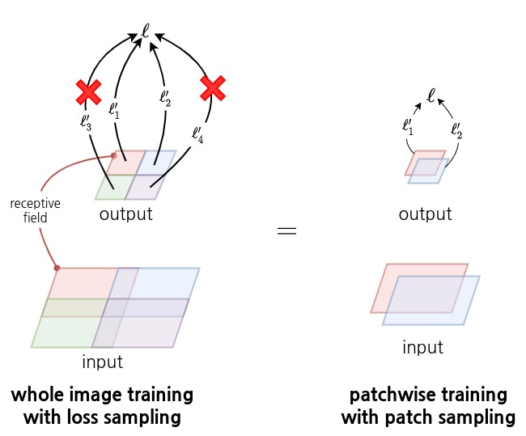

🤖 **제가 잘못 이해했을 수도 있습니다.**

# Fully Convolutional Networks for Semantic Segmentation

[paper: arxiv](https://arxiv.org/abs/1411.4038){: .btn .btn--success}

* 딥러닝 세그멘테이션 모델의 베이스
* 분류 모델의 dense 레이어를 conv 레이어로 변경하여 입력과 출력의 크기에 제한이 없다.
* 서브샘플링을 거치며 작아진 feature는 transposed conv 레이어를 통해 업샘플링

## 0. Abstract

 CNN은 강력한 비주얼 모델로 segmantic segmentation task에서 기존의 SOTA보다 좋은 성능을 낼 수 있다. 핵심은 VGG와 같은 분류 모델의 dense 레이어를 모두 conv 레이어로 교체하여 입출력의 크기 제한을 없앤 **fully-convolutional 네트워크**다. 기존의 분류 모델을 활용하므로 분류 모델이 학습한 representation을 fine-tuning하여 segmentation task에 적용시킬 수 있다. 그리고 해상도가 낮지만 글로벌한 정보가 담긴 상위 레이어의 feature와 해상도가 높아 로컬한 정보를 담은 하위 레이어의 feature를 섞어 더 정확하고 디테일한 결과를 생성하는 구조를 제시한다.

## 1. Introduction

CNN은 전체 이미지에 대한 예측(분류)뿐 아니라 로컬한 영역에 대한 예측(디텍션)까지 영역을 넓혔고 당연히 다음 단계는 픽셀 단위의 예측(세그멘테이션)이다.

이 논문에서 내놓은 FCN(Fully-Convolutional Network)은
* **기학습된 모델을 이용해 end-to-end pixelwise prediction**을 수행하는 최초의 모델
* 기존의 분류 모델을 변형하여 임의의 사이즈의 입력을 받아 dense prediction을 수행
  * dense prediction: 입력의 unit마다의 예측. ex - 세그멘테이션은 이미지의 모든 픽셀마다 어떤 클래스인지를 예측한다.
* 업샘플링 레이어를 이용하므로 서브샘플링이 가능하다.
  * 세그멘테이션은 입력과 같은 크기의 출력을 내야하는데 업샘플링 방법이 없다면 네트워크도 서브샘플링 없이 예측해야한다.
* 학습과 예측에 이미지 전체를 그대로 사용하여 효율적이다.
* 별다른 전처리, 후처리가 필요 없다.

세그멘테이션은 픽셀이 어떤 클래스인지에 대한 semantic 정보와 어떤 물체의 픽셀인지에 대한 location 정보가 균형을 이루어야한다. CNN의 상위 레이어의 출력은 여러 레이어를 거치며 고차원적인 semantic 정보를 담되 서브샘플링을 거치며 location 정보가 약하고 하위 레이어의 출력은 적은 서브샘플링 횟수로 해상도가 높아 location 정보는 보존하되 연산을 적게 거치므로 semantic 정보가 약하다. FCN은 "skip" 구조를 통해 상위 레이어의 feature와 하위 레이어의 feature를 융합할 수 있다.

## 2. Related work

## 3. Fully convolutional networks

**🤖 FCN은 입력 크기 제한이 없다.**

conv, pooling 같은 기본 요소들은 feature의 작은 영역에서만 연산이 이루어지고 상대적인 좌표에만 의존한다. 

$$\mathrm{y}_{ij}=f_{ks}(\lbrace\mathrm{x}_{si+\delta i,sj+\delta j}\rbrace_{0 \le \delta i, \delta j \le k})$$

{: .align-center}

$f_{ks}$는 커널 크기가 $k$이고 stride가 $s$인 레이어, $$\mathrm{x}_{ij}$$는 입력의 $(i,j)$ 좌표의 벡터값, $\mathrm{y}_{ij}$가 입력에 대한 $f$의 출력일 때, 연산은 $(i,j)$ 주변의 커널 크기만큼의 영역에서만 이루어진다.

위와 같은 형식을 갖는 연산들은 중첩되어도 다음과 같은 변환 룰을 통해 그 형식을 유지한다. 즉, 연산을 중첩해도 커널크기와 stride를 갖는 하나의 연산처럼 작동한다.

$$f_{ks}\circ g_{k's'}=(f\circ g)_{k'+(k-1)s', ss'}$$

{: .align-center}

이런 성질로 인해 conv, pooling 종류의 연산들로만 이루어진 네트워크는 conv, pooling이 그러하듯 **입력의 크기에 제한이 없고 입력의 크기에 상응하는 크기의 출력을 내놓는다.** 이런 네트워크를 **deep filter** 또는 **fully convolutional network**라고 한다.

**🤖 이미지 단위의 학습과 patch 단위의 학습**

loss 함수가 FCN 출력의 유닛들의(유닛: 출력의 각 셀) 개별 loss의 합 $\ell(\mathrm{x};\theta)=\sum_{ij}\ell'(\mathrm{x}_{ij};\theta)$이라면 그래디언트도 출력의 유닛들의 그래디언트의 합이 된다. 그러므로 이미지 전체를 입력하여 계산한 $\ell$에 대한 SGD는 출력의 각 유닛들의 receptive field를 patch로 하여 구성한 미니배치에 대한 SGD와 같다. 즉, FCN 출력의 유닛마다 loss가 계산된다면 "이미지 한 장을 입력해 학습시키는 것"과 "이미지에서 FCN 출력의 receptive field 영역을 crop하여 미니배치로 학습시키는 것"은 같다.

{: .align-center}

receptive field간의 겹치는 영역이 넓을수록 patchwise 학습보다는 전체 이미지 학습이 효율적이다. patchwise 학습은 patch마다 연산이 독립적이므로 겹치는 영역에 대한 연산이 반복되기 때문이다.

### 3.1 Adapting classifiers for dense prediction

일반적인 분류 네트워크의 dense 레이어는 커널이 레이어의 입력 전체를 커버할 수 있는 conv 연산으로도 볼 수 있다. flatten을 수행하는지 안하는지의 차이로 결국 레이어의 입력의 모든 유닛에 가중치가 곱해지는 것은 마찬가지다. dense 레이어의 가중치를 그대로 reshape하여 conv 레이어의 가중치로 사용한다면 출력의 차원은 달라도 그 값은 같다.

{: .align-center}

dense 레이어를 conv 레이어로 교체한 FCN은 더 이상 dense 레이어가 없으므로 임의의 사이즈의 입력을 받아 classification map을 출력한다. classification map은 공간적인 정보가 유지되어 세그멘테이션같은 dense problem에 적합하다.

FCN은 앞서 언급했듯이 출력의 유닛들의 receptive field간에 겹치는 영역이 클수록 patchwise 연산에 비해 효율적인 연산을 수행한다. 그 예로 AlexNet이 227x227 이미지에서 스코어를 출력하는데 1.2ms가 걸리는데 AlexNet을 변형한 FCN은 500x500 이미지에서 10x10 스코어맵을 출력하는데 22ms가 걸린다. 만약 patchwise로 연산을 진행했다면 10*10=100배의 시간인 120ms가 필요하지만 전체 이미지를 통으로 입력하면 스코어맵의 100개 유닛들의 receptive field가 겹치는 영역의 연산은 단 한 번만 발생하므로 1/5 정도의 시간으로도 연산이 가능한 것이다. 백워드 연산에도 적용된다.

네트워크는 stride가 1이 아닌 conv 레이어와 pooling 레이어를 포함하므로 출력은 여러번의 다운샘플링을 거치면서 작아지게된다. 구체적으로는 스코어맵 유닛들의 receptive field stride의 역수배가 된다.

### 3.2 Shift-and-stitch is filter rarefaction

🤖 출력을 다시 입력과 같은 크기로 복원하기위한 방법인 shift-and-stitch를 설명하는데 FCN에 사용하지는 않으므로 생략해도 좋다.

네트워크로부터 입력과 같은 크기의 출력을 얻기 위한 방법을 shift-and-stitch가 있다. OverFeat 논문에서 소개된 방식으로 네트워크 출력이 $f$배만큼 다운샘플링된다면 입력을 $\lbrace 0, \cdots, f-1 \rbrace$ 픽셀 shift하여 얻은 $f$개의 출력을 조합하여 최종 출력을 계산하는 방식이다.

정확히는 모르겠지만 아마도 다음과 같지 않을까?

{: .align-center}

[참고: How does shift-and-stitch in a fully convolutional network work?](https://stackoverflow.com/questions/40690951/how-does-shift-and-stitch-in-a-fully-convolutional-network-work){: .btn .btn--info}

shift-and-stitch 방식은 conv 네트워크 레이어들의 stride와 커널을 수정하여 재현할 수 있다. 먼저 하위 레이어 stride를 1로 설정하여 다운샘플링을 하지 않는다. 이 경우에 상위 레이어의 receptive field는 작아지므로 상위 레이어의 가중치에 0을 끼워넣어 receptive field를 유지한다. 다만 이러한 방식으로 네트워크를 고치면 네트워크의 모든 서브샘플링 레이어가 사라질때마다 커널 크기는 계속해서 커진다.

상위 레이어의 커널 가중치가 $f_{ij}$, 하위 레이어의 stride가 $s$라고 한다면

$$f'_{ij}=\begin{cases}f_{i/s,j/s}&\text{if s divides both i and j;}\\0&otherwise,\end{cases}$$

{:.align-center}

단순하게 stride만을 조정해 서브샘플링을 줄인다면 커널이 더 고해상도의 정보를 보지만 receptive field는 작아지고 연산이 늘어난다. shift-and-stich 방식을 적용하면 receptive field 크기를 유지하면서 dense prediction을 수행하지만 가중치에 0이 끼워넣어지며 고해상도의 정보를 제대로 보지 못한다. (이 문장의 해석이 안되어 이런 내용이 아닐지?)

FCN에서는 shift-and-stitch 대신 학습이 가능한 업샘플링을 사용한다.

### 3.3 Upsampling is backwards strided convolution

**backward convolution** 또는 **deconvolution**은 conv 연산을 역방향으로 수행하는 연산으로 입력을 업샘플링한다. 구현도 단순히 conv 연산의 forward, backward 연산의 역할을 바꾸면된다. 그러므로 역전파에 의한 학습도 가능. 실험을 통해 backward convolution을 통한 업샘플링이 빠르면서도 효과적이어서 shift-and-stitch 대신 업샘플링 방식으로 사용한다.

🤖 conv 연산의 출력을 그대로 deconvolution 연산하더라도 conv의 입력을 재현할 수는 없어 deconvolution이라는 명칭은 적절치 않다. conv의 커널을 transpose한 shape의 커널을 사용하므로 **transposed convolution**이라는 명칭이 주로 사용된다. conv의 입력의 shape만을 복원한다.

{: .align-center}

### 3.4 Patchwise training is loss sampling

전체 이미지를 통한 학습은 모델 출력의 유닛들의 receptive field 영역들로 미니배치를 만들어 patchwise 학습하는 것과 동일하다. patch간의 오버랩 등으로 전체 이미지를 통한 학습이 더 효율적이지만 patchwise 학습과 비교해 가능한 미니배치의 다양성이 줄어든다. 이를 해결하기위해 모델 출력의 일부 유닛들을 loss 계산에서 제외시키는 loss sampling을 사용할 수 있다. receptive field에 해당하는 patch 중 일부를 학습에서 제외시키는 것과 마찬가지다. 

{: .align-center}

patchwise 학습은 patch 샘플링을 통해 클래스 불균형 문제와 patch간의 결합이 강해지는 문제를 완화시킬 수 있다. 전체 이미지를 이용한 학습에서는 적은 클래스에 대한 loss weighting과 loss sampling을 통해 두 문제를 완화시킬 수 있다.

그런데 그냥 전체이미지 학습이 loss 샘플링 없이도 잘 되더라. 효율적이고 효과적이다.

🤖 patch간의 결합: 예를 들어 학습 데이터에 항상 바늘과 실이 한 이미지에 같이 있었는데 테스트 데이터에는 바늘만 혹은 실만 있다면 제대로 인식할 수 있을지. 바늘과 실이 항상 같이 있어도 patch 단위로 이미지를 나누면 바늘 또는 실만 포함된 patch를 학습하며 결합을 약화시킬 수 있을 것이다.

## 4. Segmentation Architecture

이미지넷 모델을 FCN으로 수정하고 in-network 업샘플링과 pixelwise loss를 이용해 dense prediction을 수행한다. 그리고 상위 레이어의 feature와 하위 레이어의 feature를 결합하기 위해 새로운 skip 구조를 추가한다.

### 4.1 From classifier to dense FCN

AlexNet, VGGnet, GoogLeNet 등의 이미지넷 모델의 classifier 레이어를 제거하고 dense 레이어를 conv 레이어로 교체한다. dense 레이어의 가중치는 그대로 reshape하여 conv 레이어의 가중치로 사용한다. 1x1 conv 레이어를 추가하여 각 클래스에 대한 스코어맵을 출력하도록 한다. 마지막으로 transposed conv 레이어를 추가하여 최종 스코어맵이 입력된 이미지와 같은 크기가 되도록 업샘플링한다(coarse  outputs to pixel-dense outputs).

{:.align-center}

**출처: 네이버 부스트캠프 CV 트랙 - 세그멘테이션 3강**
{: .text-center}

VGG16을 변형한 FCN은 세그멘테이션 SOTA보다 높은 성능을 기록한다.

### 4.2 Combining what and where

{:.align-center}

이미 기존의 세그멘테이션 기법들보다 높은 성능을 내고있으나 모델의 출력을 32배나 업샘플링해야하므로 결과물은 퀄리티가 좋지 않다. transposed conv를 통해 오버랩되며 다듬어지는 부분이 있다해도 1개의 픽셀로 32x32 픽셀만큼의 영역을 복원해야하니 퀄리티가 떨어진다. 이를 개선하기 위해 여러 계층의 feature를 결합하여 출력의 정확도를 개선하는 skip 구조를 추가한다.

{:.align-center}

skip 구조는 모델의 출력을 하위 레이어와 결합한다. 모델 출력은 다수의 레이어를 거치며 global 정보가 강하고, 하위 레이어의 feature는 해상도가 높아 local 정보가 강하다. 두 정보를 합쳐 모델이 전체적인 구조를 고려하면서 local prediction을 가능하도록한다.

**FCN16s**

VGG16을 기준으로 pool4 레이어의 출력에 1x1 conv를 추가하여 또 하나의 스코어맵을 만든다. 모델의 스코어맵은 pool4 스코어맵의 절반크기이므로 기존의 x32 업샘플링 대신 x2 업샘플링을 수행하여 pool4 스코어맵과 더한다. 마지막으로 x16 업샘플링을 통해 최종 출력을 생성한다.

**FCN8s**

pool3 레이어의 출력에도 FCN16s와 동일한 구조를 추가한다. pool4 스코어맵과 모델 스코어맵의 합은 x16 업샘플링 대신 x2 업샘플링 후 pool3 스코어맵과 더한다. 마지막으로 x8 업샘플링을 통해 최종 스코어맵을 생성한다.

* FCN16s, FCN8s는 각각 FCN32s, FCN16s를 기학습 가중치로 사용하고 새로운 1x1 conv는 0으로 가중치 초기화
  * 학습 초기에는 하위 레이어의 스코어맵이 최종 출력에 영향을 주지 않는다.
* x2 업샘플링 레이어(transposed conv)는 bilinear interpolation으로 초기화

{: .align-center}

**Refinement by other means**

고해상도의 스코어맵을 얻기 위해서는 네트워크의 다운샘플링을 제거하는 것이 가장 단순한 방법이다. 다만 상위 레이어들의 receptive field가 작아져 더 큰 커널을 사용해야하고 이는 학습의 어려움으로 이어진다. 다운샘플링을 제거하면서도 상위 레이어에서 작은 커널을 사용하도록 pool5 레이어 이후의 구조를 변경한 경우 성능이 좋지 않았는데 이 경우 이미지넷 기학습 가중치를 그대로 conv 레이어로 옮겨오지 못하므로 아마 이미지넷 모델의 상위 레이어의 가중치들이 중요한 역할을 하는 것으로 예측한다.

### 4.3 Experimental framework

쭉죽 생략

**Optimization** 

dropout은 분류 네트워크의 원래 위치에 똑같이 추가한다.

**Patch Sampling**

patchwise 학습은 patch를 랜덤 샘플링하면서 미니배치의 다양성을 확보하여 수렴이 더 빠를 것이다. 전체 이미지 학습으로 미니배치의 다양성을 재현하기 위해 loss sampling을 수행하고 드랍되는 receptive field patch 양을 고려하여 배치 사이즈를 키우는 방식을 사용하였다.

출력 유닛마다 $(1-p)$ 확률로 학습에서 제외하고 배치사이즈를 $\frac{1}{p}$배 키운다.
  * $p=0.2$라면 80%를 드랍하므로 배치사이즈는 5배 키운다.

{: .align-center}

하지만 loss sampling 방식을 적용한 경우와 그렇지 않은 경우를 비교하였을때 그다지 효과는 없음을 확인했다. 오히려 더 큰 배치사이즈가 필요하므로 더 긴 시간이 필요했다. 따라서 loss sampling 없이 전체 이미지 학습 방식을 이용했다.

**Dense Prediction**

FCN의 최종 transposed conv 레이어는 bilinear interpolation으로 초기화하고 프리징시킨다. 다른 x2 레이어들은 bilinear interpolation으로 초기화하되 학습이 가능하도록 프리징시키지 않는다.

## 5. Results

PASCAL VOC, NYUDv2, SIFTFlow 데이터셋에 대해 실험 진행

### Metric

* 기호
  * $n_{ij}$: 클래스 i에 속하되 클래스 j로 예측된 픽셀의 수
    * $n_{ii}$: 클래스 i로 제대로 분류된 픽셀 수
  * $t_i = \sum_j n_{ij}$: 클래스 i의 어노테이션 픽셀의 수
  * $n_{cl}$: 클래스의 수
* metric
  * pixel accuracy: $\sum_i n_{ii} / \sum_i t_i$
    * $\frac{\text{TP 픽셀 수 총합}}{\text{모든 클래스의 어노테이션 픽셀 수 총합}}$, 전체 픽셀 중 제대로 분류된 픽셀의 비율
  * mean accuracy: $(1/n_{cl})\sum_i n_{ii}/t_i$
    * 클래스별 pixel accuracy의 평균
  * mean IoU: $(1/n_{cl})\sum_i n_{ii}/(t_i + \sum_j n_{ji} - n_{ii})$
    * 클래스별 IoU의 평균. 어노테이션과 예측의 픽셀 단위 합집합이 분모.
  * frequency weighted IoU: $(\sum_k t_k)^{-1}\sum_i t_i n_{ii}/(t_i+\sum_j n_{ji} - n_{ii})$
    * (전체 픽셀 중 클래스별로 차지하는 비율)을 가중치로 삼아 클래스 별 IoU를 가중합

### PASCAL VOC

{: .align-center}

기존의 SOTA였던 SDS와 큰 성능 격차를 보여준다. 그리고 연산 속도도 훨씬 빠르다. FCN이 매우 효율적이면서도 강력함을 보여준다.

### NYUDv2

{: .align-center}

마소의 키넥트로 제작한 데이터셋으로 RGB이미지와 깊이 정보가 같이 주어지며 총 어노테이션은 40개의 클래스로 구성된다. 다양한 방식으로 모델을 생성하여 비교하였다. 
1. RGB: 이미지 학습
2. RGB-D: 이미지에 깊이 정보를 추가해 RGB 3채널 + Depth 1채널, 총 4채널 입력 (early fusion)
  * 🤖 깊이 정보가 추가되면 분리된 물체간의 깊이 차이로 경계를 찾기 쉬울 것 같은데 성능 향상은 크지 않았다.
  * 저자는 의미있는 그래디언트가 전파되기 힘들었을 것이라고 예상
    * 🤖 왜?
3. HHA: 깊이 정보를 3채널의 HHA 형식으로 인코딩하여 모델 학습
4. RGB-HHA: RGB 모델과 HHA 모델을 출력을 더한다. 두 모델은 역전파를 통해 동시에 학습된다. (late fusion)
  * RGB-D 모델과 비교하여 큰 성능 향상을 보여준다. 깊이 정보를 다른 포맷으로 인코딩하여 사용.

### SIFT Flow

{:.align-center}

33개의 semantic 카테고리와 3개의 geometric 카테고리로 구성된 데이터셋. 두 카테고리를 모두 예측하기 위해 FCN-16s에 헤드를 하나 추가했다. 독립된 두 모델만큼 성능이 높으면서 inference와 학습도 빠르다. 역시 SOTA 성능을 기록.

## 6. Conclusion

분류 네트워크는 fully convolutional 네트워크의 특별한 케이스이므로 분류 모델을 세그멘테이션 테스크가 가능하도록 확장하고 skip 구조를 통해 다른 계층의 feature들을 합성하면 SOTA 성능을 보이면서도 학습과 inference를 더 빠르게 수행할 수 있다.
