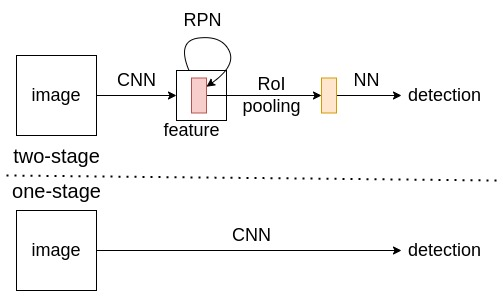
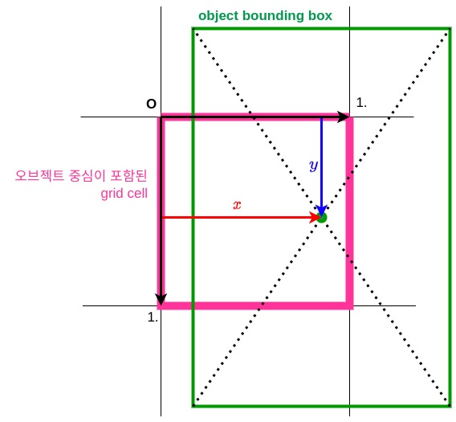
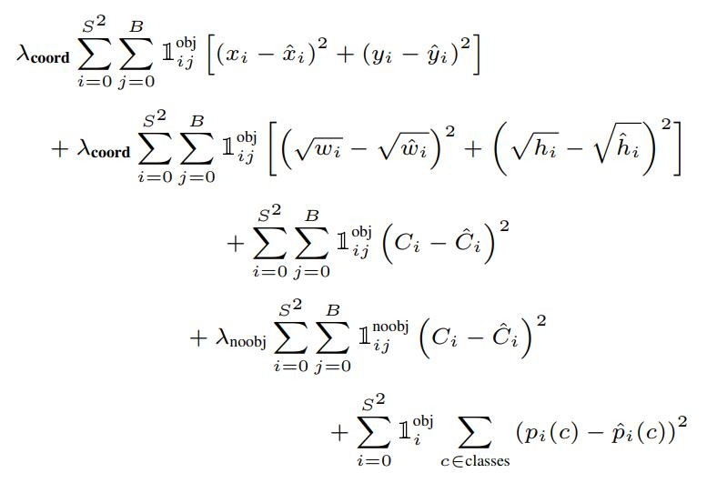
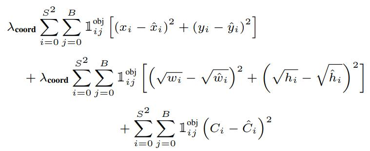
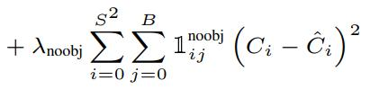
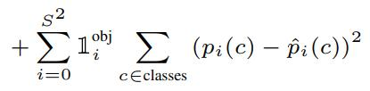
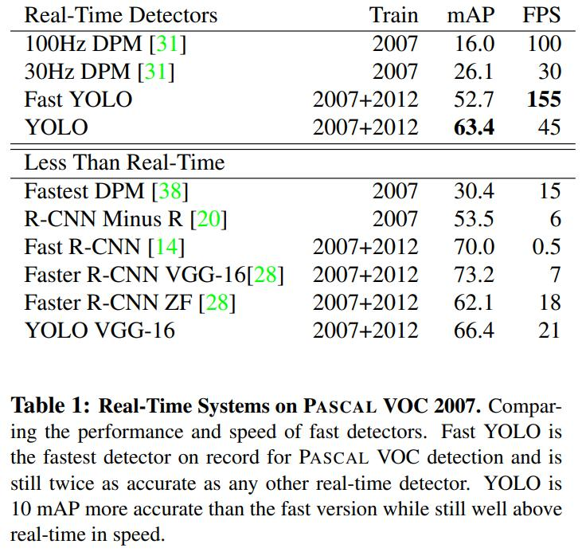
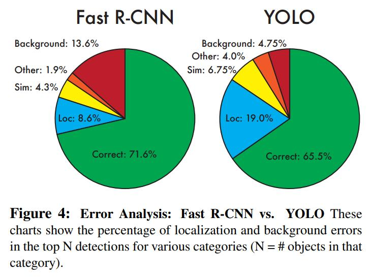
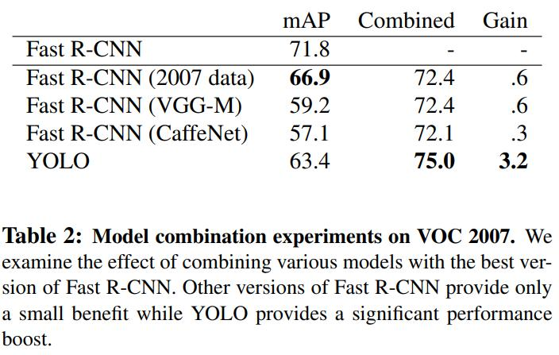
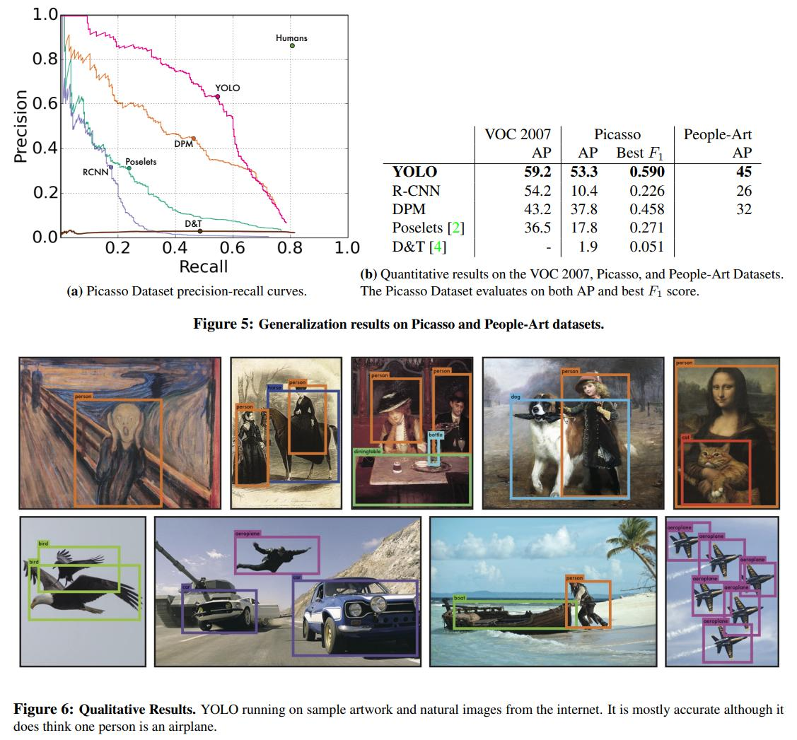

# 🤖 YOLOv1

[구현: github](https://github.com/canlion/YOLOv1-pytorch){: .btn .btn--danger}

{:.align-center}

(아직 논문 성능을 완전히 재현하지 못함 ㅎㅎ / Resnet18 backbone)
{:.text-center}

최근 v7까지 나올 정도로 계속해서 개선이 이루어지는 실시간 오브젝트 디텍션의 대표적인 모델.

## 🦾 1 stage vs 2 stages

{: .align-center}

R-CNN은 2 stages 디텍터, YOLO는 1 stage 디텍터의 대표적인 모델.

* 2 stages: 이미지에서 selective search 또는 작은 신경망을 통해 오브젝트가 있음직한 영역을 탐색하여 선별한 영역에 어떤 오브젝트가 있는지 판단하고 오브젝트 바운딩 박스를 다듬는 방식
  * 높은 디텍션 성능 / 느림
* 1 stages: 이미지에서 신경망을 통해 바로 오브젝트의 바운딩 박스, 클래스를 예측하는 방식
  * 상대적으로 낮은 디텍션 성능 / 빠름

### 🦿 R-CNN 계열

{: .align-center}

**Fast R-CNN: [arXiv:1504.08083](https://arxiv.org/pdf/1504.08083.pdf)**
{: .text-center}

1. selective search를 통한 region proposal(후보 영역 선별)
2. CNN을 통한 feature 추출
3. feature에서 후보 영역에 대응되는 영역을 추출 (RoI pooling)
  * RoI pooling
    * 후보 영역에 대응되는 feature 영역을 일정 비율로 분할하여 분할된 구역마다 pooling
    * 후보 영역의 크기에 관계없이 고정된 크기의 feature를 추출
4. pooling한 feature를 classification & box regression

region proposal 과정 + 선별한 영역을 한 번 더 분류 및 바운딩 박스 리그레션을 수행하므로 속도가 느리지만 높은 디텍션 성능을 보여줌. 다만 여러 컴포넌트들을 독립적으로 튜닝하므로 과정이 번거롭고, 최종적인 디텍션 성능을 직접적으로 최적화하는 것이 아니므로 최적화 과정이 어려움.

## 🦾 YOLO

{:.align-center}
**YOLO: [arXiv:1506.02640](https://arxiv.org/pdf/1506.02640.pdf)**
{: .text-center}

region proposal 과정 없이 이미지에서 바로 바운딩 박스와 클래스를 예측하는 방식.

### 🦿 오브젝트 디텍션을 regression 문제로 취급

이전의 디텍터들은 분류 모델이 디텍션을 수행하도록 추가적인 컴포넌트들을 덧붙이는 접근 방식을 취하여 분류모델 + region proposal 컴포넌트 + classification & regression 컴포넌트 + NMS 처럼 복잡한 파이프라인을 구성함.

하지만 YOLO는 **오브젝트 디텍션을 regression 문제로 취급**하여 하나의 네트워크로 문제를 해결하려고 시도, **여러 컴포넌트들을 하나의 CNN으로 통합하여 CNN + NMS라는 단순한 구조**를 택함.

### 🦿 구조

{:.align-center}
**YOLO: [arXiv:1506.02640](https://arxiv.org/pdf/1506.02640.pdf)**
{: .text-center}

conv + fully conn.라는 일반적인 CNN 구조. activation은 leaky relu 사용. fully conn.사이에는 dropout(p=0.5)을 추가.

* 구조가 단순하므로 빠르다.
* end-to-end 학습이 가능. 디텍션 성능을 직접 최적화.
* fully conn. 레이어를 통해 바운딩 박스와 클래스를 예측 -> 이미지 전체 영역의 feature를 이용하므로 글로벌한 컨텍스트를 이용.
  * R-CNN 계열의 모델들이 디텍션 성능면에서는 월등하지만 선별된 영역에 해당하는 feature만을 이용해서 예측하므로 FalsePositive(백그라운드를 오브젝트가 있다고 착각)가 많음.
  * YOLO는 상대적으로 디텍션 성능이 낮지만 글로벌한 컨택스트를 이용하므로 FalsePositive는 적음.

### 🦿 작동 방식

1. 이미지를 S x S 격자 형태로 분할, (S*S개의 구역을 그리드 셀이라고 표현)
2. 각 그리드 셀에서는 B개의 (바운딩 박스, 컨피던스 스코어)를 예측, 한 세트의 조건부 클래스 확률을 예측(한 세트 = 클래스의 수 C개)
  * **S*S개의 그리드 셀 중 오브젝트의 중심을 포함한 그리드 셀은 그 오브젝트를 디텍션해야함.**
  * 한 세트의 조건부 클래스 확률: "셀에 오브젝트가 존재할때!" 클래스 확률 $Pr(Class_i\|Object)$. 하나의 그리드 셀에 개와 자전거, 자동차가 포함되어도 오직 하나의 클래스만을 선택해야함.
  * 컨피던스 스코어: 예측한 바운딩 박스에 오브젝트가 포함되었는지, 얼마나 바운딩 박스를 잘 잡았는지를 나타내는 점수, $Pr(Object) * IoU^{\text{target}}_{\text{prediction}}$
3. 이미지에서 예측된 총 (S * S * B)개의 바운딩 박스를 NMS
  * NMS를 위한 스코어는 (클래스 확률 * 컨피던스 스코어)로 계산. 박스를 얼마나 잘 잡았는지, 어떤 클래스인지 표현. $Pr(Class_i \vert Object) * Pr(Object) * IoU = Pr(Class_i) * IoU$

바운딩 박스는 yolo만의 xywh 포맷으로 표현한다. xy는 그리드 셀을 기준으로 바운딩 박스의 중심 위치를 그리드 셀 크기로 정규화한 값, wh는 바운딩 박스의 가로, 세로를 이미지의 가로, 세로 크기로 나눠 정규화한 값이다. xywh 모두 0.~1. 범위에 속한다.

{:.align-center}

### 🦿 학습

20단 conv + average pool + fully conn.으로 이루어진 CNN을 이미지넷에 pretrain시켜 백본으로 활용 (top-5 acc. 88%). 이후 기학습된 20단 conv에 새로운 4단 conv, fc, dropout, fc (activation: leaky, output activation: linear)을 얹어 yolo를 완성한다. 디텍션 성능을 위해 pretrain 과정에서 이용한 입력 사이즈 224x224를 두배로 키워 448x448 입력 사이즈를 이용. 

학습 과정에서 하나의 그리드 셀에 여러 타겟 오브젝트가 위치해도 하나의 타겟 오브젝트만을 학습한다. 타겟 오브젝트가 주어진 그리드 셀은 B개의 박스를 예측하지만 그 중 타겟 오브젝트와의 IoU가 가장 높은 박스를 타겟과 매칭하여 학습한다. 이 경우 그리드 셀의 B개의 predictor는 **각자 특정한 크기, 가로세로 비율의 오브젝트에 특화되어** 전체적인 recall이 향상된다.

{:.align-center}
**YOLO: [arXiv:1506.02640](https://arxiv.org/pdf/1506.02640.pdf)**
{: .text-center}

squared-sum loss를 이용한다.
* $1^{obj}_{ij}$: i번째 그리드 셀의 j번째 predictor가 타겟 오브젝트와 IoU가 가장 높은 경우 1, 아니면 0.
  * i번째 그리드 셀에 타겟 오브젝트가 존재하고, j번째 predictor의 박스와의 IoU가 가장 높음 = 1
  * i번째 그리드 셀에 타겟 오브젝트가 존재하지만, j번째 predictor의 박스와의 IoU가 가장 높지는 않음 = 0
  * i번째 그리드 셀에 타겟 오브젝트가 없음 = 0
* $1^{obj}_{i}$: i번째 그리드 셀에 타겟 오브젝트가 존재하면 1, 아니면 0.

{:.align-center}

타겟 오브젝트가 존재하는 그리드 셀에서 **가장 IoU가 높은 predictor만 loss 계산**. 바운딩 박스의 가로, 세로 크기에 제곱근을 취한 것은 같은 크기의 오차라도 박스 크기에 따라 loss값에 차등을 주기 위함이다. 예를 들어 크기가 1000px인 박스에서의 10px 만큼의 오차와 크기가 20px인 박스에서의 10px 만큼의 오차는 비중이 다르다.

컨피던스 스코어 타겟은 **타겟 오브젝트와 박스의 IoU**. (오브젝트가 존재하므로 $Pr(Object) = 1.$)

{:.align-center}

**(1)** 타겟 오브젝트가 없는 그리드 셀의 B개의 predictor, **(2)** 타겟 오브젝트가 존재하는 그리드 셀에서 IoU가 가장 높지는 않은 B-1개의 predictor의 컨피던스 스코어 loss 계산. 타겟은 0.

(2)의 경우 predictor를 오브젝트의 특정한 크기, 비율에 특화시키기 위해 컨피던스 스코어 타겟을 0으로 학습시키는 듯?

{:.align-center}

**타겟 오브젝트가 존재하는 그리드 셀만** classification loss 계산. 어떤 클래스의 오브젝트가 존재하는지를 의미하는 값이 아닌, 오브젝트가 존재할때 어떤 클래스인지를 나타내는 조건부 클래스 확률이므로 그리드 셀에 오브젝트가 존재할때만 패널티를 준다.

### 🦿 한계

그리드 셀마다 한정되 수(B개)의 predictor만 존재하고 한 세트의 클래스만을 예측하는 제약이 심한 디자인으로 그리드 셀에서 디텍션할 수 있는 오브젝트의 수와 종류가 제한된다. 특히 작고 무리지은 오브젝트 그룹에 취약함.

다운 샘플링을 여러번 수행한 거친 feature에서 박스를 예측하고, loss 계산시에 박스의 가로, 세로 크기의 제곱근을 학습하지만 박스의 중심 에 대해서는 박스 크기를 반영하지 못하므로 localization error가 높다.

### 🦿 실험

**VOC2007**

{:.align-center}

동시대의 다른 실시간 디텍터보다 빠르면서도 성능은 훨씬 높다. R-CNN 계열과 비교하면 디텍션 성능은 떨이지지만 속도는 압도적으로 빠름.

{:.align-center}

위는 VOC2007 test 데이터셋에 대한 에러를 분석한 그래프.
* Loc: localization error, 클래스는 제대로 예측했지만 박스를 제대로 예측하지 못한 경우 (0.1 < IoU < 0.5)
* Background: FalsePositive, 오브젝트가 아닌 배경을 오브젝트로 판단한 경우 (IoU < 0.1)

Fast R-CNN의 경우 region proposal을 활용해 오브젝트가 있을법한 영역을 선정한 후, 각 후보 영역을 classification & regression 하므로 바운딩 박스를 잘 잡아내며 localization error가 낮다. 하지만 후보 영역을 classification & regression 하는 경우 후보 영역의 feature만을 이용(작은 범위의 컨텍스트만 이용)하여 Background error가 높다.

YOLO의 경우 앞서 이야기한 이유로 localization error가 높으나 모든 예측에 글로벌 컨텍스트를 이용하므로(feature 전체를 이용) Background error가 낮다.

{:.align-center}

Fast R-CNN과 YOLO를 앙상블하는 경우 성능 향상이 두드러진다. Fast R-CNN끼리만 앙상블하는 경우 성능 향상폭이 매우 적으므로 이 결과는 단순히 앙상블로 인한 성능 향상이 아닌, 두 모델이 생성하는 에러의 종류가 다르므로 YOLO가 Fast R-CNN의 약점을 보완하며 발생한 성능 향상으로 볼 수 있다.

### 🦿 Generalizability

디텍터를 실제 어플리케이션에 적용할 경우 항상 학습 데이터와 같은 도메인의 데이터만 입력되지는 않는다. 실제 활용에서도 좋은 성능을 내려면 다른 도메인의 데이터에도 잘 작동해야한다. 즉, 일반화 성능이 좋아야한다.

{:.align-center}

YOLO와 다른 디텍터를 VOC 데이터로 학습시킨 후 미술품에 어노테이션한 아트워크 데이터셋에서 사람을 디텍션하는 테스트하는 실험을 진행.
* VOC2007: VOC2007 데이터셋 학습
* Picasso: VOC2012 데이터셋으로 학습하여 Picasso 데이터셋에 테스트
* People-art: VOC2010 데이터셋으로 학습하여 People-art 데이터셋에 테스트

**R-CNN**의 경우 AP가 크게 감소한다. selective search가 실제 이미지에 대해 튜닝되어 미술품에 대해서는 제대로 region proposal을 수행하지 못한다. 또 region만을 보고 classification을 수행하므로 region proposal 성능 저하는 classification 성능 저하로 이어진다.

**DPM**의 경우 큰 성능 저하는 없다. DPM에서 특징 추출에 이용하는 HOG(엣지 픽셀의 방향 고려), SIFT(회전, 형태 변화에 강한 특징점을 찾고 주변의 그래디언트 고려) 등의 알고리즘은 오브젝트의 형태, 레이아웃을 다루기 때문이다.

❓ HOG, SIFT에 대해 학습이 필요. 아마 미술품은 실제 이미지와 질감, 명암, 색감 등이 다르지만 오브젝트 자체의 형태는 크게 다르지 않아 그래디언트, 엣지를 다루는 HOG, SIFT의 성능이 크게 감소하지 않는다는 것 같다.
{: .notice--primary}

**YOLO**도 성능 저하가 크지 않았다. YOLO는 오브젝트간의 관계, 주로 나타나는 위치 뿐만 아니라 DPM처럼 오브젝트의 크기, 형태를 모델링하므로 좋은 성능을 유지한다.

❓ DPM처럼 오브젝트의 크기, 형태를 모델링한다는 것은 가장 IoU가 높은 predictor만 학습하며 특정한 크기, 비율에 특화되는 것을 말하는 것 같다.
{: .notice--primary}

### 🦿 결론

* 기존의 복잡한 OD 파이프라인을 간결하게 압축, 단순한 구조의 단일 네트워크로 구성.
* 기존 디텍터들과 비교하여 연산 속도 - 디텍션 성능 트레이드 오프에서 매우 뛰어남.
* end-to-end 학습으로 디텍션 성능을 직접 최적화.
* 실시간 오브젝트 디텍션의 SOTA.
* 뛰어난 일반화 성능으로 다른 도메인의 데이터에 대해서도 좋은 성능을 발휘.
