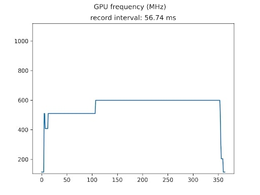
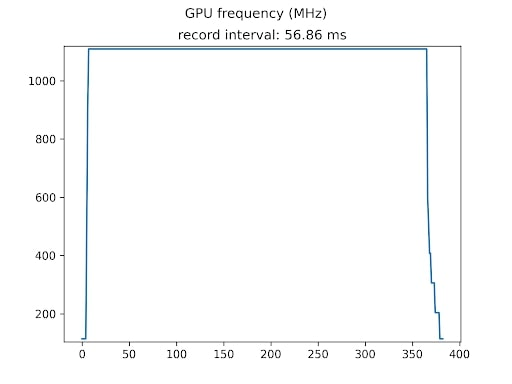
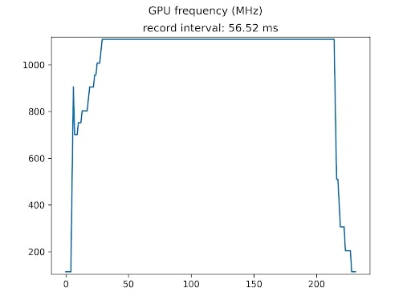
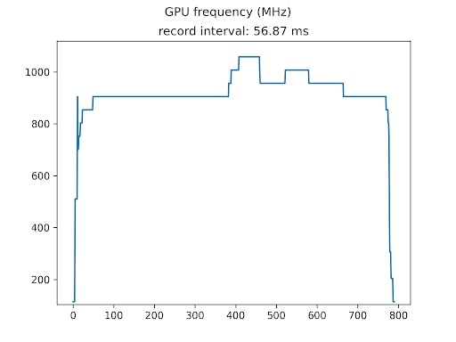
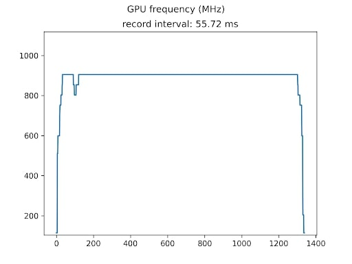

tensorrt 관련 업무 중 더미 입력의 인퍼런스 속도가 실제 이미지의 인퍼런스 속도보다 훨씬 빠른 상황이 발생함.

```python
# dummy input
dummy_input = np.random.randint(...)
for _ in range(N):
    model(dummy_input)

# image load
for path in img_paths:
    img = cv2.imread(path)
    ...
    model(img)
```

A100, 2070 super, jetson Xavier NX에서 모두 발생하며, 특히 A100에서는 더미 입력의 인퍼런스 시간이 실제 이미지 인퍼런스 시간의 절반 수준.

[TensorRT runs much slower for non-continuous inference](https://github.com/NVIDIA/TensorRT/issues/2107){: .btn .btn--info}

검색을 해보니 인퍼런스를 짧은 간격으로 수행하지 않을 경우 GPU가 idle 상태로 전환되며 다음 인퍼런스때 인퍼런스 시간이 더 많이 필요하게 된다는 것 같다.
내 경우에는 이미지를 로드하는 짧은 시간동안 그러한 상황이 반복되었나보다.

* 데스크탑에서는 `nvidia-smi -q -d SUPPORTED_CLOCKS`로 지원되는 클럭을 확인 후 `sudo nvidia-smi -lgc <freq>` 클럭 설정
* jetson에서는 `sudo jetson_clocks`로 GPU 클럭을 고정

위의 두 설정을 사용하면 더미 입력과 이미지 인퍼런스간의 속도 차이가 사라진다. 다만 jetson의 경우 `sudo jetson_clocks --show`로 성능 설정을 확인하면 클럭이 아예 최대 성능으로 고정되므로 보드 수명에 무리가 갈 것으로 예상된다.

---

그런데 다른 모델들을 돌려보니 다음과 같은 상황이 관찰된다.
* (기존) 인퍼런스 간격에 따라 추론 속도가 다르다.
* yolov7-tiny 모델은 인퍼런스 사이의 시간 지연이 없더라도 `jetson_clocks` 설정한 경우에 그렇지 않은 경우보다 훨씬 인퍼런스 속도가 빠르다.
* yolov7 모델은 `jetson_clocks` 설정 여부와 인퍼런스 간격에 영향을 받지 않고 일정한 인퍼런스 속도를 갖는다.

이는 모델에 따라, 인퍼런스 간격에 따라 GPU frequency가 다르게 돌아간다는 것이고 jetson stats 레포를 이용해 GPU frequency를 기록해보니 실제로도 그렇다.

[Jetson stats](https://github.com/rbonghi/jetson_stats){: .btn .btn--info}

* 모델 규모에 따라 (인퍼런스 간격 0 sec.)
  * |yolov7-tiny|yolov7|
    |--|--|
    |||
  * 모델 규모에 따라 동작하는 frequency가 다르다.
* 인퍼런스 간격에 따라
  * yolov7-custom (레이어 제거하여 경량화)
  * |0.0sec|0.1sec|0.2sec|
    |------|------|------|
    ||||
  * 인퍼런스 사이의 시간 지연에 따라 frequency가 다르다.

상황을 종합해보면 **①** 모델 규모에 따라, **②** 인퍼런스 간격에 따라 GPU frequency가 달라진다. **③** 다만 모델 규모가 어느정도 커지면 인퍼런스 간격에 무관하게 최대 frequency로 동작.

**결론은 단위시간에 수행되는 연산량에 따라 GPU가 자동으로 frequency를 조정하는 듯 하다.**
  * yolov7-tiny는 연산량이 적어 낮은 frequency로 설정
  * yolov7-custom은 연산량이 중간 정도로 인퍼런스 사이의 간격이 생기면 단위시간당 연산량이 줄어들어 frequency를 낮게 설정
  * yolov7은 연산량이 많아 항상 최대 frequency로 설정
